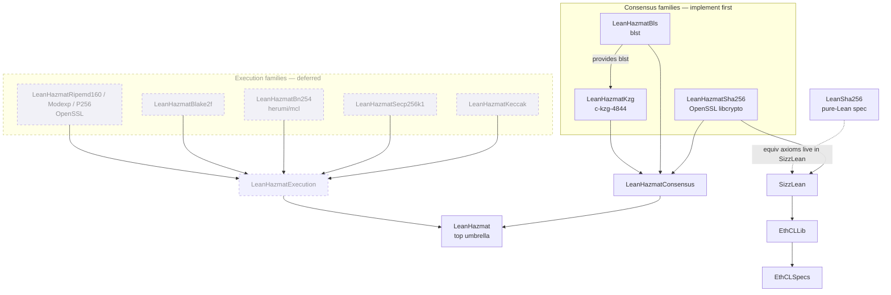
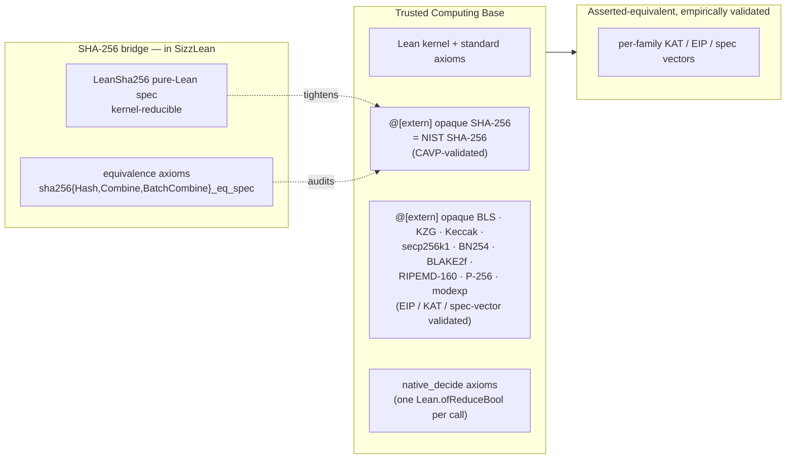

# LeanHazmat: Architecture

## 1. Context

LeanHazmat is the FFI crypto surface for the *Etheorem* monorepo: a **family of
Lean 4 packages** that wrap battle-tested native cryptographic libraries behind
`@[extern]` bindings, one package per primitive family, each carrying a
documented trust boundary. It covers **all** the cryptography the Ethereum
protocol needs, **consensus *and* execution layer**, but ships as independent
per-family packages rather than one monolith (see §3 for why this is the load-
bearing decision).

It is the FFI counterpart to the pure-Lean reference library `LeanSha256` (a
sibling subpackage at [`../packages/LeanSha256/`](../packages/LeanSha256/)).
Where `LeanSha256` reduces inside the Lean kernel and carries proofs, LeanHazmat
links compiled native code and validates it against official test vectors.
**SHA-256 is the bridge case**: it has *both* a pure-Lean spec (`LeanSha256`)
*and* an FFI binding (`LeanHazmatSha256`), joined by an equivalence axiom that
lives in `SizzLean`, the one layer entitled to import both (§9).

The name "hazmat" is the cryptographers' idiom (cf. pyca/cryptography's `hazmat`
module) for raw, low-level primitives deliberately placed behind a safety
boundary, exactly the FFI trust framing this family is built around. It carries
no Ethereum reference, per the project's naming constraint.

**Scope is crypto-only.** LeanHazmat is *not* an FFI SSZ backend. SizzLean's
*verified* SSZ stays the single source of truth; an FFI SSZ would undermine the
formal-verification goal, and there is no standout C SSZ library worth the trust
cost. (If an FFI SSZ seam is ever wanted, it is a `.ffi` arm on `SSZ.Box`
validated by an equivalence axiom, a SizzLean concern that stays outside LeanHazmat.)

This document is written to be read from both ends: a Lean-fluent reader who has
not internalised the Ethereum crypto stack, and a crypto/protocol-fluent reader
who has not written Lean. Where either side names something the other has not
seen, the first occurrence is glossed. This mirrors CLAUDE.md's "Literate by
default" stance and is binding on the implementation files this document plans,
not only on the document.

### Sibling subpackages, in terms of dependency direction

LeanHazmat is a **leaf**: it depends on nothing consensus-spec upstream. Crypto
FFI operates on bytes, and its KAT (Known-Answer-Test) vectors are byte-level, so
the consensus *container* types are never needed. The relationships run the other
way:

* **`LeanSha256`**: pure-Lean SHA-256 reference. LeanHazmat does **not** depend
  on it. The *equivalence axioms* tying the FFI SHA-256 to the spec live in
  `SizzLean`, the only layer that legitimately imports both.
* **`SizzLean`**: the SSZ library. After the SHA-256 migration (§9) it
  `require`s `LeanHazmatSha256` (FFI hash) **and** `LeanSha256` (spec), owns the
  `Hasher` typeclass and the `Sha256` tag, and holds the FFI≡spec equivalence
  axioms. It depends on no other LeanHazmat family.
* **`EthCLLib` / `EthCLSpecs`**: the consensus-spec framework and the
  Fulu/Gloas specs built on it; consume `SizzLean`. No direct
  LeanHazmat dependency.

See [`../monorepo-arch.md`](../monorepo-arch.md) for the monorepo's overall
shape and [`../packages/SizzLean/docs/ARCHITECTURE.md`](../packages/SizzLean/docs/ARCHITECTURE.md)
§9/§11 for the `Hasher` abstraction and trust boundary on the SizzLean side.

## 2. Architecture at a glance

The defining decision is that LeanHazmat is **not one package**. Each crypto
family is its own Lake package, self-contained, so a consumer compiles **only
what it `require`s**. The families are grouped by protocol layer behind two
aggregator meta-packages, with a top umbrella over both.



(Arrows read *dependency → dependent*, matching SizzLean's diagrams: `A --> B`
means "B `require`s A". The dashed cluster is deferred to a later phase.)

**What per-family packaging buys, and why a monolith is wrong.** Lake links
*all* of a package's `extern_lib`s together into any precompiled library or
executable that depends on that package; it cannot tell which `@[extern]` symbol
lives in which archive, so it links them all. A single `LeanHazmat` package
owning every C library would therefore force **every** consumer to compile
**every** library. Notably, `SizzLean` `require`s the SHA-256 family, and the
whole repo builds on `SizzLean`, so a monolith would make every clean build of
the repository compile blst, c-kzg, mcl, secp256k1, and keccak even though only
SHA-256 is wanted. Per-family packaging is what keeps the common build path
(LeanSha256 → SizzLean → EthCLLib → EthCLSpecs) at *one* cheap system-linked
dependency. See §3.1.

**What "no shared code" buys.** Every family package is self-contained, with zero
internal dependencies (the one exception in §4). That makes each one
independently mirror-publishable to its own repo with no dangling dependency,
the `LeanSha256` property, which is the unit Reservoir indexes (§11).

**The brand survives decomposition.** Splitting into many packages does not
fracture the API: every family lives under the shared `LeanHazmat` brand
namespace (each in its own `LeanHazmat.<Family>` sub-namespace,
`LeanHazmat.Bls.sign`, `LeanHazmat.Kzg.verifyBlobKzgProof`, …) regardless of
which package ships it, and the aggregator meta-packages
(`LeanHazmatConsensus`, `LeanHazmatExecution`, `LeanHazmat`) re-export the
families for consumers who want a whole layer at once (§3.4).

## 3. The package model

### 3.1 Per-family, split by compile cost

Each crypto family is its own package. The granularity follows **compile cost**,
which in turn follows **vendored vs. system**:

- **Vendored libraries**: blst (assembly + C), c-kzg-4844, herumi/mcl (C++),
  libsecp256k1, keccak are genuinely expensive to compile, and that cost is
  what per-family isolation exists to contain. Each gets its own package.
- **OpenSSL-backed shims**: SHA-256, RIPEMD-160, P-256, modexp are ~zero-
  compile, a small `.c` shim linking the *system* `libcrypto.so`, nothing heavy
  built from source. They are still per-family, but for **API clarity and
  independent mirror-ability**, not compile isolation.

The cost is one-time and Lake-cached: once a vendored library is compiled to a
`.a` archive, Lake's trace system skips it on every subsequent build. The
per-family split is what makes that one-time cost land *only on consumers who ask
for that family*.

### 3.2 Flat layout: package = directory = mirror repo

Family packages are flat top-level directories under `packages/`:
`packages/LeanHazmatSha256/`, `packages/LeanHazmatBls/`, and so on. This is
dictated by two forces that agree:

1. **The repo convention**: "directory name = package name = library = module
   root" (see [`../monorepo-arch.md`](../monorepo-arch.md)).
2. **The mirror tooling**: `git subtree split --prefix=packages/<Pkg>` projects
   `packages/<Pkg>/` to the standalone repo `etheorem/<Pkg>` (§11). The prefix
   *is* the directory path and the downstream repo name.

**Rejected: nesting** under `packages/LeanHazmat/<Family>/`. It would group the
brand visually but break the 1:1 directory = package = repo mapping that both the
convention and the subtree-split tooling rely on (the directory `Sha256` would no
longer equal the package `LeanHazmatSha256` or the repo `etheorem/LeanHazmatSha256`).

### 3.3 No shared code; no `LeanHazmatCore`

There is **no shared utility library**. The default is duplication over a shared
dependency:

- The lakefile build helpers (pkg-config discovery, glob auto-discovery; ~40
  lines) are **duplicated** per family lakefile. They cannot be shared anyway: a
  `lakefile.lean` cannot import another package's code, because the lakefile
  *defines* the build graph before anything in it is built (a bootstrap cycle).
  The duplicated surface is small and stable, and vendored families don't need
  pkg-config at all.
- A byte-level KAT test harness is likewise copied into each family's test lib.

The one cross-package coupling that *is* allowed is a `require` to share a heavy
vendored library, see §4. It is the sole exception; everything else is
independent.

**Namespace vs. module-root.** The package, library, and module-root name is
flat `LeanHazmat<Family>` (so `import LeanHazmatSha256`), while the **API
namespace is `LeanHazmat.<Family>`**: declarations live under a per-family
sub-namespace of the `LeanHazmat` brand: `LeanHazmat.Sha256.sha256Hash`,
`LeanHazmat.Bls.sign`, `LeanHazmat.Kzg.verifyBlobKzgProof`. A consumer
`import`s the package and `open`s its sub-namespace (`open LeanHazmat.Bls`),
so the qualified name reflects which family a symbol comes from and bare
names don't collide across families. The module path and namespace are
decoupled the way SizzLean decouples the file path
`SizzLean/Hasher/Sha256.lean` from its `SizzLean.Hasher` namespace: the
import name reflects the *package* (`LeanHazmatBls`), the declaration names
reflect the *brand + family* (`LeanHazmat.Bls`).

### 3.4 Aggregator libraries

Three meta-packages sit *downstream* of the families (they `require` families,
never the reverse), each a pure `lakefile.toml` with no C of its own, just a
root module that `import`s and re-exports the family roots:

| Aggregator | Re-exports | For |
| --- | --- | --- |
| `LeanHazmatConsensus` | `…Sha256` + `…Bls` + `…Kzg` | "all consensus crypto" |
| `LeanHazmatExecution` | the EL families | "all execution crypto" |
| `LeanHazmat` | `LeanHazmatConsensus` + `LeanHazmatExecution` | "everything" |

A consumer wanting one primitive `require`s a single family package; one wanting
a whole layer `require`s the aggregator. Because aggregators carry no compiled
artefacts, depending on one only pulls the compile cost of the families it
actually re-exports.

### 3.5 Per-family directory shape

```
packages/LeanHazmat<Family>/
├── lakefile.lean              # C target(s) + extern_lib; pkg-config helpers (duplicated)
├── csrc/<family>_shim.c       # the @[extern] shim(s)
├── vendor/                    # gitignored; populated by `just vendor-<family>` (vendored libs only)
├── data/                      # e.g. trusted_setup.txt for Kzg (loaded at init)
├── LeanHazmat<Family>.lean    # root; re-exports; declarations in namespace LeanHazmat[.<Family>]
├── LeanHazmat<Family>/        # module(s)
├── LeanHazmat<Family>Tests/   # byte-level KAT; NO upstream deps; copy any helper type locally
├── LeanHazmat<Family>Tests.lean
├── docs/ARCHITECTURE.md       # trust boundary for this family
└── README.md
```

Aggregator packages drop `csrc/`, `vendor/`, and `data/`, and use a declarative
`lakefile.toml`.

## 4. Cross-package dependencies

The default is independence; a family may `require` another **only** when it
structurally needs that family's *heavy vendored library*, so a single compiled
copy is shared instead of being built twice. Surveying the whole surface,
**exactly one pair qualifies.**

- **`LeanHazmatKzg` → `LeanHazmatBls`** (shares **blst**). c-kzg-4844 is built on
  top of blst, which `LeanHazmatBls` already owns. So `LeanHazmatBls` is the
  **single blst owner**, pinned to the rev c-kzg-4844 expects; `LeanHazmatKzg`
  links Bls's blst archive and compiles only c-kzg's own `.c` sources against it
  (*not* c-kzg's bundled `--recursive` blst). Accepted tradeoff: `LeanHazmatKzg`
  is then the one family that is not zero-dependency, so a standalone Kzg mirror
  must also pull Bls.

No other pair qualifies, and what keeps the list at one is a standing principle:

> **LeanHazmat exposes raw primitives, not assembled precompiles.**

The EL precompiles that *compose* primitives are the **consumer's** job, not
LeanHazmat's. Examples are ecRecover (`0x01`) = secp256k1-recover **+** keccak256
+ truncate, and modexp's length-prefixed input parse + gas schedule. So
`LeanHazmatSecp256k1` exposes raw ECDSA recovery (→ public key) and does *not*
depend on `LeanHazmatKeccak`; address derivation lives in the caller. Holding
this line is what prevents composition dependencies from multiplying.

The other near-misses:

- **OpenSSL families** (`…Sha256`, `…Ripemd160`, `…P256`, `…Modexp`) all touch
  the same *system* `libcrypto`, but there is no compiled artefact to share, and
  a `require` cannot share lakefile discovery code anyway. Independent.
- **secp256k1 / BN254 / Keccak / BLAKE2f** each own a library no other family
  uses. Independent.

## 5. Backends

| Family → package | Backend | Lang | Source | Rationale |
| --- | --- | --- | --- | --- |
| SHA-256 → `…Sha256` | OpenSSL `libcrypto` | C | system (pkg-config) | SHA-NI assembly, fastest on the SSZ merkleization hot path; system lib (no vendored maintenance); blst's SHA-256 is not stable public API. Reversible behind SizzLean's `Hasher` seam. |
| BLS12-381 → `…Bls` | `blst` | C + asm | vendored | The field reference implementation; covers consensus BLS *and* every EIP-2537 EL precompile. |
| KZG → `…Kzg` | `c-kzg-4844` | C | vendored | The consensus reference; covers blob/commitment/proof, Fulu PeerDAS cells, and the EIP-4844 point-eval precompile. Built on blst (§4). |
| secp256k1 → `…Secp256k1` | `libsecp256k1` | C | system if present, else vendored | bitcoin-core's reference; ecRecover. |
| BN254 / alt_bn128 → `…Bn254` | `herumi/mcl` | C++ | vendored | Reference for alt_bn128 add/mul/pairing. |
| RIPEMD-160 / P-256 / modexp → `…Ripemd160` / `…P256` / `…Modexp` | OpenSSL | C | system | RIPEMD-160 via the 3.x legacy provider; P256VERIFY via NIST P-256; modexp via `BN_mod_exp` (BIGNUM). |
| Keccak-256 → `…Keccak` | XKCP or a small vetted keccak | C | vendored | *Not* SHA3, different padding; OpenSSL SHA3 will not do. |
| BLAKE2f → `…Blake2f` | hand-rolled RFC 7693 F-compression | C | in-repo | EIP-152 needs the raw rounds-parametrised `F`; too small to justify a dependency. |

**Rejected backends.** *constantine* (consolidating BLS + KZG + BN254 onto one
newer library): fewer deps and a smaller TCB, but it trades the per-domain gold
standards for a single less-proven library. *GMP* for modexp: a new system
dependency that only wins for very large exponents; `BN_mod_exp` reuses OpenSSL,
already present.

## 6. Vendoring and build

**Prefer system pkg-config where a real system package exists.** OpenSSL is
discovered today exactly as SizzLean already does it (`pkg-config --libs/--cflags
libcrypto`, with a Debian fallback); `libsecp256k1` ships a `.pc` file and can be
added the same way. System linking has no compile cost and no vendored-source
audit burden.

**Otherwise vendor by shallow fetch into a gitignored tree.** A `just
vendor-<family>` recipe runs `git clone --recursive --depth 1` at a *pinned tag*
into `vendor/` (gitignored), executed once at setup and as a CI step *before*
`lake build`. Shallow clone keeps fetch time and size down; `--recursive` carries
nested submodules (c-kzg's blst) correctly, which a GitHub source tarball would
not (tarballs omit submodule contents). The *build* itself stays offline and
hermetic, no network mid-build.

**Compile via Lake targets, never a standalone Makefile.** Per CLAUDE.md's
"configure, don't integrate": the C compilation is expressed as Lake `target` +
`extern_lib` declarations (the SizzLean `sha256_shim.o` → `libssz_sha256` shape
is the template). Where a vendored library has a non-trivial build of its own,
the Lake target *delegates to that build* (e.g. invoking c-kzg's own make) rather
than re-deriving its compiler flags. We do not author a parallel orchestration
Makefile.

**No git submodules.** The pin lives in the `just vendor-<family>` recipe (tag +
recorded rev), not as a tracked submodule gitlink. This keeps `vendor/` out of
the repo's git history entirely and avoids submodule UX for contributors.

**C++ toolchain note.** `LeanHazmatBn254` (herumi/mcl) is the one family built
from C++: it needs a C++ compiler, `extern "C"` wrappers around the Lean-facing
symbols, and `-lstdc++` (or `-lc++`) at link. Every other shim is plain `cc` C.
This is budgeted for upfront in the BN254 stage.

## 7. Crypto surface: consensus layer (Phase 0 → Gloas)

Three families → three packages. Keccak-256 and secp256k1/ECDSA are
execution-layer only and excluded here.

| Family → package | Spec usage | Functions |
| --- | --- | --- |
| **SHA-256** → `LeanHazmatSha256` | SSZ `hash_tree_root`/merkleization, `compute_shuffled_index`, RANDAO mixing, deposit Merkle proofs | `hash(data)`, 2-chunk `combine`, batched `combine` |
| **BLS12-381** → `LeanHazmatBls` (minimal-pubkey-size, ciphersuite `BLS_SIG_BLS12381G2_XMD:SHA-256_SSWU_RO_POP_`) | Attestations, block signatures, sync committees, deposits, exits | `Sign`, `Verify`, `Aggregate`, `AggregateVerify`, `FastAggregateVerify`, `eth_aggregate_pubkeys`, `eth_fast_aggregate_verify`, `KeyValidate` |
| **KZG / polynomial commitments** → `LeanHazmatKzg` (Deneb+; Fulu adds PeerDAS cells) | Blob sidecar verification, gossip validation, DAS | `blob_to_kzg_commitment`, `compute_kzg_proof`, `compute_blob_kzg_proof`, `verify_kzg_proof`, `verify_blob_kzg_proof`, `verify_blob_kzg_proof_batch`; Fulu: `compute_cells_and_kzg_proofs`, `verify_cell_kzg_proof_batch`, `recover_cells_and_kzg_proofs` |

## 8. Crypto surface: execution layer

Dominated by **precompiles**, plus two non-precompile workhorses (Keccak-256, and
the bignum behind modexp). Several EL items **reuse** consensus packages and cost
zero new dependencies: SHA-256 (`0x02`) → `…Sha256`; KZG point-eval (`0x0a`) →
`…Kzg`; EIP-2537 BLS → `…Bls`. Per the §4 principle, each package exposes the raw
primitive; the precompile's input parsing, gas, and output composition stay with
the consumer.

| EL primitive → package | Used by | Library | vs. consensus stack |
| --- | --- | --- | --- |
| **Keccak-256** → `…Keccak` | KECCAK256 opcode, addresses, storage slots, MPT trie, RLP | XKCP / small keccak | 🆕 new, *not* SHA3 |
| **ecRecover** (`0x01`) → `…Secp256k1` | tx sender recovery | `libsecp256k1` | 🆕 new |
| SHA-256 (`0x02`) → *reuse `…Sha256`* | precompile | OpenSSL | ✅ have |
| **RIPEMD-160** (`0x03`) → `…Ripemd160` | precompile | OpenSSL (3.x legacy provider) | ♻️ same lib |
| **modexp** (`0x05`, EIP-2565/7883) → `…Modexp` | precompile | OpenSSL `BN_mod_exp` | ♻️ reuse BIGNUM |
| **bn254** add/mul/pairing (`0x06/07/08`, EIP-196/197/1108) → `…Bn254` | alt_bn128 precompiles | `herumi/mcl` | 🆕 new, BN254, *not* BLS12-381 |
| **BLAKE2f** (`0x09`, EIP-152) → `…Blake2f` | precompile | hand-rolled RFC 7693 | 🆕 small |
| **KZG point eval** (`0x0a`, EIP-4844) → *reuse `…Kzg`* | precompile | c-kzg-4844 | ✅ have |
| **BLS12-381** G1/G2 (EIP-2537, Pectra) → *reuse `…Bls`* | precompiles | blst | ✅ have |
| **P256VERIFY** secp256r1 (EIP-7951, Fusaka) → `…P256` | precompile | OpenSSL (NIST P-256) | ♻️ reuse OpenSSL |

**Genuinely new for the EL:** Keccak-256, secp256k1, BN254 (mcl), BLAKE2f. The
OpenSSL-backed EL shims (RIPEMD-160, modexp, P256) are ~zero-compile.

## 9. The SHA-256 bridge

SHA-256 is the only primitive with a *double life*: a kernel-reducible pure-Lean
reference (`LeanSha256`) **and** the FFI binding (`LeanHazmatSha256`). They are
tied together by named equivalence axioms. The **axioms live in `SizzLean`**,
the only layer that legitimately imports both the FFI binding and the spec, so
neither leaks into the other.

The SHA-256 migration moves the FFI binding *out* of SizzLean into
`LeanHazmatSha256` while leaving the bridge in place:

- **Moves to `LeanHazmatSha256`** (namespace `LeanHazmat.Sha256`, function names
  unchanged): the
  C shims `sha256_shim.c` + `sha256_batch.c`; the three `@[extern] opaque` decls
  `sha256Hash` / `sha256Combine` / `sha256BatchCombine`; the OpenSSL pkg-config
  discovery and C build targets.
- **Stays in `SizzLean`**: the `Hasher` typeclass, the `Sha256` tag, the
  `instance : Hasher Sha256` (rewired to `LeanHazmat.Sha256.sha256Hash`/`sha256Combine`),
  and **all three** equivalence axioms (`sha256Hash_eq_spec`,
  `sha256Combine_eq_spec`, `sha256BatchCombine_eq_spec`) plus the
  `sha256BatchCombineSpec` reference def. Today's `Hasher/Sha256*.lean` files
  therefore **split**: the externs cross the package boundary; the spec defs and
  axioms stay behind with the typeclass.
- **Tests split by what they prove**: CAVP byte-level KAT ("the FFI *implements*
  SHA-256") → `LeanHazmatSha256Tests`; the FFI ↔ pure-Lean equivalence
  cross-checks that *back the axioms* → stay in `SizzLeanTests`, since they need
  both `LeanHazmatSha256` and `LeanSha256`.

The proof-tactic discipline for goals that touch these hashes (symbolic `rfl` vs.
`native_decide` vs. the equivalence-axiom rewrite vs. kernel `decide` on the
spec) is unchanged and documented in CLAUDE.md's "Proofs involving SSZ hashes"
and [`../packages/SizzLean/docs/ARCHITECTURE.md`](../packages/SizzLean/docs/ARCHITECTURE.md)
§9/§11. PLAN.md Stage 1 sequences the move.

## 10. Trust boundary

Two regimes. SHA-256 is special; everything else is opaque.



- **SHA-256** keeps its kernel-reducible spec (`LeanSha256`) and the three
  checkable equivalence axioms, NIST-CAVP validated. The axioms make the trust
  assumption ("the FFI shim implements SHA-256") visible under `#axioms` and
  replaceable in one place when a `@[csimp]`-proved equality eventually lands.
- **Everything else** (BLS, KZG, Keccak, secp256k1, BN254, BLAKE2f, RIPEMD-160,
  P-256, modexp) has **no pure-Lean reference**. Each is an opaque `@[extern]`
  FFI boundary with no equivalence lemma, validated only against official
  EIP/KAT/spec vectors. Each `@[extern] opaque` carries a docstring naming the
  empirical assumption it rests on, and all are visible under `#axioms`.

This asymmetry is intentional: SHA-256 is in the SSZ proof path (so the spec +
axioms earn their keep), while the rest sit at the protocol boundary where a
kernel-checkable reference would be a large independent project for little proof
benefit today.

## 11. Distribution / mirroring

Distribution is **one mirror repo per *published* package**, deferred and opt-in
per family. Reservoir (the Lean package index) indexes repository **roots**, not
monorepo subdirectories, so a family is invisible to it until it has its own repo
at `etheorem/LeanHazmat<Family>`. The flat layout (§3.2) exists precisely so that
`git subtree split --prefix=packages/LeanHazmat<Family>` projects cleanly to that
repo; `packages/LeanSha256/` and `.github/workflows/mirror-leansha256.yml` are
the reference implementation.

Two things keep this cheap and optional:

- **Mirroring is for discoverability.** A downstream consumer can
  already `require` a family straight from the monorepo (git URL + `subDir :=
  packages/LeanHazmat<Family>`) with no mirror. A mirror only makes the family
  appear in Reservoir's index/search.
- **Every family is self-contained** (§3.3), so each splits to a standalone repo
  with no dangling dependency, except `LeanHazmatKzg`, which (per §4) requires
  `LeanHazmatBls`; a Kzg mirror must therefore also pull a Bls mirror.

A mirror carries real per-package overhead (a dedicated deploy key + secret, a
`mirror-<pkg>.yml` workflow, local `LICENSE`/`lean-toolchain`/`lake-manifest.json`
copies, a version-bump script, a redirect banner). It is decided family-by-family
as each matures; the aggregators are unlikely to need their own mirrors.

## 12. Module / namespace layout

Toolchain is inherited from the repo root (`leanprover/lean4:v4.29.1`); no
per-package override. Each package declares `licenseFiles = ["../../LICENSE"]`
until/unless it is promoted to a mirror, at which point it carries a local
`LICENSE` copy with `licenseFiles = ["LICENSE"]` (the mirror-playbook shape).

```
<repo root>/
├── lakefile.toml                       # umbrella; [[require]] per family + aggregator
├── lean-toolchain                      # leanprover/lean4:v4.29.1 (inherited everywhere)
├── hazmat-docs/                        # this directory: cross-family ARCHITECTURE.md + PLAN.md
└── packages/
    ├── LeanHazmatSha256/               # consensus — OpenSSL (system); SHA-256
    ├── LeanHazmatBls/                  # consensus — blst (vendored)
    ├── LeanHazmatKzg/                  # consensus — c-kzg-4844 (vendored; blst via …Bls)
    ├── LeanHazmatConsensus/            # aggregator — re-exports the three (toml)
    ├── LeanHazmatKeccak/               # execution — keccak (vendored)            [deferred]
    ├── LeanHazmatSecp256k1/            # execution — libsecp256k1                 [deferred]
    ├── LeanHazmatBn254/                # execution — mcl (vendored, C++)          [deferred]
    ├── LeanHazmatBlake2f/              # execution — hand-rolled RFC 7693         [deferred]
    ├── LeanHazmatRipemd160/            # execution — OpenSSL (legacy provider)    [deferred]
    ├── LeanHazmatModexp/               # execution — OpenSSL BIGNUM               [deferred]
    ├── LeanHazmatP256/                 # execution — OpenSSL (P256VERIFY)         [deferred]
    ├── LeanHazmatExecution/            # aggregator — re-exports EL families (toml)[deferred]
    └── LeanHazmat/                     # top umbrella — Consensus + Execution (toml)
```

`import LeanHazmatSha256` brings the `LeanHazmat.Sha256.*` names
(`LeanHazmat.Sha256.sha256Hash`, …) into scope; the package name is the import
unit, the namespace is the brand + family sub-namespace (§3.3).

## 13. Conventions

This document is binding on layout and dependencies for the LeanHazmat family.
CLAUDE.md is binding on style and discipline: imports first; `set_option
autoImplicit false` per file; PascalCase for types, lowerCamelCase for defs;
namespacing under `LeanHazmat.<Family>`; no committed `#eval` / `#check` / `#print`
(`example : … := by …` and `#guard` are the load-bearing alternatives);
structural recursion or `termination_by` over `partial def`. Where the two
overlap, CLAUDE.md wins on form and this document wins on architectural substance.

The load-bearing convention is **literate by default**:

- Every `*.lean` file opens with a `/-! … -/` module docstring framing it for a
  reader who knows one side of the FFI/crypto divide but not the other.
- Every public declaration carries a `/--` *why*-docstring. For each `@[extern]
  opaque`, that docstring **names the empirical trust assumption** the binding
  rests on (which library, which spec/EIP/KAT validates it). A future reader
  inspecting `#axioms` should find the context there.
- Non-obvious Lean idioms (`@[extern]`, `@&` borrowed args, `opaque`,
  `native_decide`'s axiom) are annotated the first time they appear in a module,
  not the fifth; same for crypto terms a Lean-fluent reader won't recognise
  (ciphersuite, G1/G2, trusted setup, the legacy provider).
- `example` / `#guard` blocks accompany the user-facing API at every family; the
  typechecker keeps them honest in a way prose cannot.

Each family package also carries its own `docs/ARCHITECTURE.md` recording
*its* trust boundary (library, version pin, validation vectors); this document is
the cross-family view those single-family docs hang under.

## 14. Sequencing

**Consensus first; execution deferred.** Each phase is a green-build checkpoint;
a per-family mirror is an optional later step, never a phase gate.

| Phase | Scope | Constraints |
| --- | --- | --- |
| **1: Consensus core** | `LeanHazmatSha256` (the SHA-256 migration out of SizzLean) → `LeanHazmatBls` → `LeanHazmatKzg` → `LeanHazmatConsensus`. | SHA-256 goes first as the cross-package de-risk: it exercises the whole per-family machinery (a new package, `SizzLean` requiring it, link-arg behaviour, the axiom split, the test split) on the one family that needs *no* vendoring. Vendoring (and the `just vendor-*` harness) enters with BLS. KZG depends on BLS (§4). |
| **2: Execution layer** | Keccak; secp256k1; BN254 (mcl, the C++ toolchain step); BLAKE2f; the OpenSSL EL shims (RIPEMD-160 / modexp / P256); `LeanHazmatExecution`; the top `LeanHazmat` umbrella. | Independent of one another except where a primitive reuses a consensus package (point-eval, EIP-2537, SHA-256 precompile). Each exposes a *raw* primitive; precompile composition (input parse, gas, output hashing) is the consumer's. |

The single highest-risk item in Phase 1 is **cross-package link-arg propagation**:
whether Lake carries a package's `extern_lib`/`moreLinkArgs` to a dependent's
link step (today `EthCLLib` and `EthCLSpecs` hand-mirror OpenSSL args rather than
inheriting them, so it is *not* assumed). PLAN.md Stage 0 settles it with a one-package
experiment before any code moves, because the answer decides whether
`LeanHazmatSha256` can be the single pkg-config home or whether downstream
packages re-run discovery.
