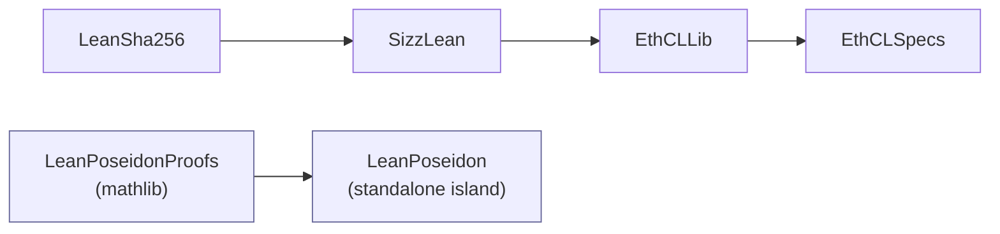
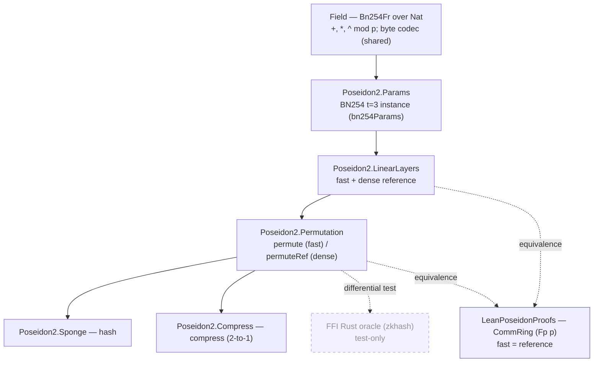
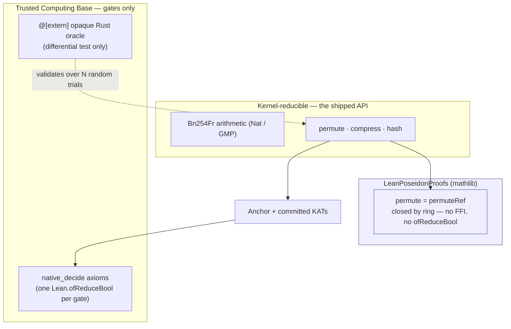

# LeanPoseidon: Architecture

## 1. Context

LeanPoseidon is a Lean 4 library implementing the **Poseidon2** algebraic
hash permutation ([eprint 2023/323](https://eprint.iacr.org/2023/323.pdf)):
the field-arithmetic permutation, the 2-to-1 compression function, and a
sponge over arbitrary-length input, all in pure Lean, plus a Rust FFI
*oracle* used only for differential conformance testing, and a
machine-checked theorem that the shipped fast implementation computes the
same field elements as the textbook dense-matrix reference.

It is a sibling subpackage in the *Etheorem* monorepo (see
[`../../../README.md`](../../../README.md) and
[`../../../docs/monorepo-arch.md`](../../../docs/monorepo-arch.md)). The package is
named `LeanPoseidon`; it implements the **Poseidon2** variant of the
permutation. Poseidon **v1** is *not* reimplemented here. Nethermind's
[`Poseidon.lean`](https://github.com/NethermindEth/Poseidon.lean) already
covers it and stays an external reference only; the README links it for
readers who need v1.

The goal is the algebraic-hash counterpart to the monorepo's existing
pure-Lean SHA-256 reference (`LeanSha256`): a *faithful, formally-checked*
Poseidon2 anyone can depend on directly, kernel- and
`native_decide`-reducible, with empirical conformance against a trusted
external implementation and a proof that the standard sparse-layer
optimisation is sound.

**Why Poseidon2, why now.** Ethereum is evaluating Poseidon2 as a
ZK-friendly hash candidate for the unified binary state tree
([EIP-7864](https://eips.ethereum.org/EIPS/eip-7864)); the EF-funded
[Poseidon Cryptanalysis Initiative](https://www.poseidon-initiative.info/)
is assessing its security. Neither the hash choice nor the encoding of
state-tree leaves into field elements is finalised upstream (EIP-7864's
current draft uses BLAKE3 as a placeholder). This library is therefore a
*reference primitive* that stays clear of any consensus binding. See §"Relationship to the
rest of the monorepo" for why it deliberately does not wire into the SSZ
side yet.

This document binds the design of the LeanPoseidon library. Where it overlaps
with [`../../../CLAUDE.md`](../../../CLAUDE.md), ARCHITECTURE.md wins on
substance and CLAUDE.md wins on form. The companion
[`PLAN.md`](PLAN.md) sequences the work into stages with concrete
deliverables and acceptance criteria.

The doc is written to be readable from both ends: a Lean-fluent reader who
has not internalised the Poseidon2 permutation, and a
cryptography-fluent reader who has not written Lean. Where either side
names something the other has not seen, *sponge*, *S-box*, *MDS matrix*,
*partial round* on one side; *subtype*, `native_decide`, `CommRing`,
`@[extern] opaque` on the other, the first occurrence is glossed and the
rest of the document proceeds. This mirrors CLAUDE.md's "Literate by
default" stance and is binding on the implementation files this document
plans, not just on the document.

## Relationship to the rest of the monorepo



* **It is a standalone island.** LeanPoseidon depends on nothing in the
  monorepo and, for now, nothing depends on it. It sits *parallel* to
  `LeanSha256` (the other pure-crypto primitive), not inside the
  `LeanSha256 → SizzLean → EthCLLib → EthCLSpecs` SSZ chain. The umbrella
  `lakefile.toml` `[[require]]`s it so `lake build` at the root builds it,
  but no sibling imports it.

* **`LeanPoseidonProofs`**: a second subpackage at `../../LeanPoseidonProofs/`.
  It `[[require]]`s `LeanPoseidon` (`../LeanPoseidon`) **and mathlib**, the
  monorepo's only mathlib dependency. It holds the `CommRing (Fp p)` instance
  and the fast-≡-reference equivalence theorem (§9). It is isolated in its
  own package precisely so that the shipped core and its conformance gates
  stay mathlib-free and fast; mathlib's long compile and toolchain
  coupling never reach a downstream `LeanPoseidon` consumer.

* **No SizzLean `Hasher` bridge, deferred on purpose.**
  `SizzLean/Hasher/Class.lean` already anticipates a future `Poseidon2`
  hasher tag, and the class is shaped so adding one is a one-instance
  change. We do **not** wire it yet, on the *spec-is-the-source-of-truth*
  principle:
  - EIP-7864's hash is non-final (BLAKE3 placeholder; Poseidon2 a
    candidate under security review);
  - the `bytes → field` encoding for state-tree leaves is *explicitly
    undetermined* upstream; and
  - SSZ feeds its `Hasher` arbitrary 32-byte chunks, but BN254's modulus
    is ~254-bit, so any binding must pick an encoding (reduce mod r:
    lossy/collision; reject ≥ r: partial; limb-split: total but changes
    the width story). No project has decided this.

  Inventing an SSZ↔LeanPoseidon binding ahead of the spec is exactly the
  "don't invent" smell CLAUDE.md warns against. When EIP-7864 settles a
  hash *and* an encoding, the bridge is a clean Open/Closed addition: a
  pure-Lean `SizzLean/Hasher/Poseidon.lean` calling `LeanPoseidon.compress`
  (no FFI, no axiom, so SSZ roots under LeanPoseidon would be provable by
  plain `native_decide`), reusing `Bn254Fr`'s byte codec (§3). See PLAN.md's
  *Deferred: SizzLean `Hasher` bridge* section.

## 2. Architecture at a glance

Two packages. The core is a straight pipeline of field, parameters, linear
layers, permutation, and public API, with two orthogonal concerns hanging off
the permutation: an FFI oracle for differential testing, and an
equivalence proof. Dependencies flow top-to-bottom; nothing lower imports
anything higher.



**What this approach buys.**

- **A mathlib-free, reducible core.** `Bn254Fr` is backed by Lean's `Nat`
  (GMP big-integers under the hood), so the entire permutation reduces in
  the kernel and under `native_decide`. The anchor known-answer test
  (KAT) is a build-time gate, exactly as `LeanSha256`'s three FIPS §B
  vectors are. Downstream consumers pay no mathlib tax.

- **Conformance without an official KAT suite.** Poseidon2 has no
  centralised NIST-style vector set. Instead we pin the HorizenLabs fixed
  vectors as anchors *and* run live differential testing against a trusted
  Rust oracle over thousands of seeded-random inputs (§8). The FFI serves
  only as a *test oracle*, kept off the shipped path.

- **The optimisation is proved.** Poseidon2 ships with cheap
  linear layers (sum-plus-scaled-diagonal) that replace the textbook dense
  `t×t` matrix multiplies. We implement *both* and prove them equal as a
  generic linear-algebra identity over any commutative ring (§9), the
  machine-checked "the fast path is faithful" result. This is the
  LeanPoseidon analogue of `LeanSha256`'s structural-conformance lemmas, but
  stronger: a full functional equality, not just shape.

## 3. The field `Bn254Fr` (and the prime-field abstraction)

**Purpose.** The default coefficient field: `Bn254Fr`, the **scalar
field** `Fr` of the BN254 ("alt_bn128") curve, order the 254-bit prime
`bn254FrModulus` (the group order `r`, *not* the ~256-bit base-field prime
`q`). The name is deliberately concrete: an unadorned `Fp` reads as "some
prime field", but this is one specific field, and the library is built to
support more than one (see *Abstracting the field* below).

```lean
/-- `Bn254Fr` = integers mod `bn254FrModulus`, carried as a `Nat` below the
modulus. `{ x // P x }` is Lean's subtype: a value paired with an erased
proof that the predicate holds. -/
structure Bn254Fr where
  val   : Nat
  isLt  : val < bn254FrModulus
```

- **Why `Nat`, not a Montgomery limb representation.** Lean's `Nat` is
  GMP-backed, so big-prime `mul` / `mod` are fast both at runtime and
  under `native_decide`. The FFI oracle is the speed path for testing;
  the pure-Lean field is a *reference*, so clarity and reducibility beat
  micro-optimised limbs. It also keeps the core mathlib-free. The ring
  laws are not needed by the core, only by `LeanPoseidonProofs` (§9).
- **Operations.** `add`, `mul`, `sub`, `neg`, and `pow` (for the `x^5`
  S-box), each `mod bn254FrModulus` by construction, plus `Add` / `Mul` /
  `Pow` instances so the layers read like arithmetic.
- **Byte codec, the one home for endianness.** `Bn254Fr.toBytes` and
  `Bn254Fr.ofBytes? : ByteArray → Option Bn254Fr` are the *single*
  canonical encoding of a field element as 32 bytes. Endianness is pinned
  here against the big-endian anchor KAT (§6) and is the **only** place a
  byte order is chosen. The FFI ABI (§8) consumes this codec, and any
  future SSZ binding would too. `ofBytes?` is partial (`Option`) because a
  32-byte value can exceed the modulus; the codec never silently reduces.

### Abstracting the field (Stage 10a, ✅ done)

The permutation and linear layers are **generic over their coefficient
type `R`** (`Poseidon2/LinearLayers.lean` / `Poseidon2/Permutation.lean`
require only the minimal Lean-core classes `Add`, `Mul`, `Sub`, `One`,
`Inhabited`), so the algebra is field-agnostic; the field abstraction makes
the *concrete field* configuration rather than a hardcoded type too:

- **Shape (as built).** `Field.lean` defines a modulus-parameterised
  `structure Fp (p : Nat) where val : Nat; isLt : val < p` (a `ZMod`-style
  bounded-`Nat`), with all arithmetic, instances, and the byte codec
  defined once over `{p} [NeZero p]` (the Lean-core `NeZero` class supplies
  `0 < p` for the `_ % p < p` bound). The default is `abbrev Bn254Fr := Fp
  bn254FrModulus`. Each additional field (a different curve's `Fr`,
  Goldilocks, BabyBear, …) is then a new modulus + its `NeZero` instance,
  just new *data* over the same arithmetic. (A `PrimeField` typeclass was
  the alternative; the parameterised structure was preferred for its single
  canonical representation.)
- **Hot path preserved, verified.** The abstraction is purely
  *structural*: `Bn254Fr` is a **reducible `abbrev`** for `Fp
  bn254FrModulus`, so the generic instances and `native_decide`-reducibility
  transfer with no representation change: still `Nat`/GMP-backed, no
  Montgomery limbs, no typeclass-method indirection at the leaves. The
  anchor KAT and the 100k-trial differential pass **unchanged** after the
  abstraction, confirming `permute` / `compress` reduce exactly as the
  hand-monomorphised field did. Qualified `Bn254Fr.{ofNat, toBytes,
  ofBytes?}` are thin `abbrev` re-exports of the `Fp.*` definitions, so call
  sites are untouched.
- **Remaining (Stage 10b, deferred).** Additional *widths* (`t = 2/4`) and
  additional *field instances* with their anchor KATs, new data only; see
  §13 Phase 4.

### 3.1 Files

| File | Role |
| --- | --- |
| `packages/LeanPoseidon/LeanPoseidon/Field.lean` | `def bn254FrModulus`; the modulus-parameterised `structure Fp (p)` with arithmetic + `Pow` + byte codec over `{p} [NeZero p]`; `abbrev Bn254Fr := Fp bn254FrModulus` + qualified re-exports; `#guard` identities (incl. a generic `Fp 7` gate). |

## 4. Parameters and the BN254 t=3 instance

**Purpose.** Capture a Poseidon2 instance as data, so widths and fields are
*configuration*, not hardcoding (CLAUDE.md: *configure, don't integrate*;
*Open/Closed*).

```lean
structure Params (R : Type) where
  t             : Nat                 -- state width (number of field elements)
  fullRounds    : Nat                 -- R_f (split half before / half after)
  partialRounds : Nat                 -- R_p
  sboxDegree    : Nat                 -- d (= 5 for BN254 t=3)
  roundConstants : Array R            -- flattened ARK constants
  intDiag        : Array R            -- internal-matrix diagonal, length t
```

**Glossary (for the Lean-fluent reader).** A Poseidon2 *permutation* mixes
a *state* of `t` field elements through a sequence of rounds. A *full
round* applies the non-linear S-box `x ↦ x^d` to all `t` elements; a
*partial round* applies it to one element only (cheaper, and where most of
the rounds live). *Round constants* (ARK = "add round key") are added
before each S-box layer. Between S-box layers, a *linear layer* (a matrix
multiply, §5) diffuses the state.

The **BN254 t=3** instance is pinned first: `t = 3` (rate-2 / 2-to-1
compression, the width binary Merkle trees use), S-box `x^5`,
`fullRounds = 8`, `partialRounds = 56`. That gives `8·3 + 56 = 80` round
constants plus a 3-entry internal diagonal.

**Transcription is correctness-critical** and therefore mechanised: the
constants are emitted from the pinned HorizenLabs reference by
`scripts/gen_poseidon_params.py` (the analogue of `LeanSha256`'s
`gen_sha256_cavp.py`), not hand-typed. The anchor KAT (§6) and the
differential test (§8) are the safety net that catches any mistranscription.

### 4.1 Files

| File | Role |
| --- | --- |
| `packages/LeanPoseidon/LeanPoseidon/Poseidon2/Params.lean` | `structure Params`; the generated BN254 t=3 constant instance; size `#guard`s (80 round constants, 3-entry diagonal). |
| `packages/LeanPoseidon/scripts/gen_poseidon_params.py` | Emits `Params.lean` constants from a pinned reference commit. Stdlib-only Python; wrapped as `just gen-poseidon-params`. |

## 5. Linear layers: fast and reference

This is the conceptual heart of the library and the subject of the
equivalence proof.

Poseidon2 defines two linear layers: the **external** matrix `M_E` (used in
the full rounds and once at the start) and the **internal** matrix `M_I`
(used in the partial rounds). The paper's optimisation is that, for the
chosen matrices, the dense `t×t` matrix–vector product collapses to a
sum-plus-scaled form costing `O(t)` adds instead of `O(t²)` multiplies.

| | external `M_E` (t = 3) | internal `M_I` |
| --- | --- | --- |
| **fast** (shipped) | `s = Σ xᵢ; outᵢ = xᵢ + s` | `s = Σ xᵢ; outᵢ = s + (diagᵢ − 1)·xᵢ` |
| **reference** | literal dense `t×t` matrix–vector product | literal dense `t×t` matrix–vector product |

For `t = 3` the external matrix is `circ(2,1,1)` (i.e. `M[i][j] = 1 + δᵢⱼ`),
so `outᵢ = xᵢ + (x₀+x₁+x₂)` is exactly the dense product; the internal
matrix is `J + diag(diagᵢ − 1)` (all-ones plus a diagonal), giving the
scaled-sum form. Both equalities are ring identities, and *that* is what §9
proves.

```lean
def mulExternalFast (p : Params R) (st : Vector R p.t) : Vector R p.t
def mulInternalFast (p : Params R) (st : Vector R p.t) : Vector R p.t

def mulExternalRef  (p : Params R) (st : Vector R p.t) : Vector R p.t  -- dense
def mulInternalRef  (p : Params R) (st : Vector R p.t) : Vector R p.t  -- dense
```

(`Vector R n` is Lean core's length-indexed array, carrying its length
as a proof, so the matrix dimensions are checked by the type.)

All four are exported as **public** so `LeanPoseidonProofs` (§9) can import them
to state the equivalence. They are generic over `R` so the same definitions
serve both the concrete `Bn254Fr` core and the generic-ring proof.

> **As built (t = 3 specialisation).** Because the shipped instance is
> `t = 3`, the implementation pins the width concretely, so the layers operate
> on `Vector R 3` (not the abstract `Vector R p.t` sketched above), which
> makes the literal `circ(2,1,1)` and `J + diag` matrices well-typed and the
> component indexing proof-free. `intDiag` carries the actual diagonal
> `[2,2,3]`, and the dense reference is a literal 3×3 product
> (`mulMat3`); the external matrix is fixed, so `mulExternalFast/Ref` take no
> params. Genericity over `R` is retained (the proof needs it); genericity
> over `t` is the deferred Phase-4 follow-up. The S-box is likewise
> specialised to `d = 5` (`x²·x²·x`).

### 5.1 Files

| File | Role |
| --- | --- |
| `packages/LeanPoseidon/LeanPoseidon/Poseidon2/LinearLayers.lean` | `mulExternalFast` / `mulInternalFast` + `mulExternalRef` / `mulInternalRef`, generic over `R`. |

## 6. The permutation

```lean
def permute    (p : Params R) (st : Vector R p.t) : Vector R p.t  -- fast layers
def permuteRef (p : Params R) (st : Vector R p.t) : Vector R p.t  -- dense layers
```

`permute` runs the standard Poseidon2 schedule:

1. initial external linear layer `M_E`;
2. `fullRounds / 2` full rounds: add round constants (all `t`) → `x^d` on
   all → `M_E`;
3. `partialRounds` partial rounds: add one constant → `x^d` on element 0
   only → `M_I`;
4. `fullRounds / 2` full rounds (as step 2).

**Factoring for a clean proof.** `permute` and `permuteRef` are written so
the *only* difference between them is which linear-layer functions they
call (`*Fast` vs `*Ref`); the round-constant additions and the S-box are
byte-for-byte identical. Concretely, the shared schedule is parameterised
over the two layer ops, with `permute`/`permuteRef` as the two
instantiations. This makes `permute = permuteRef` a straight congruence on
the layer equalities (§9) rather than a fight against structural mismatch.

**Anchor KAT.** A single `native_decide` example at the bottom of this file
locks the permutation against the HorizenLabs BN254 t=3 reference: input
state `[0, 1, 2]` produces

```
perm[0] = 0x0bb61d24daca55eebcb1929a82650f328134334da98ea4f847f760054f4a3033
perm[1] = 0x303b6f7c86d043bfcbcc80214f26a30277a15d3f74ca654992defe7ff8d03570
perm[2] = 0x1ed25194542b12eef8617361c3ba7c52e660b145994427cc86296242cf766ec8
```

`native_decide` evaluates the permutation via compiled code and adds one
`Lean.ofReduceBool` axiom (it trusts the compiler's reduction; see §10).
Building the library runs this gate. It passes or the implementation is
wrong, caught at compile time. This mirrors the three in-file FIPS §B
asserts that anchor `LeanSha256`.

### 6.1 Files

| File | Role |
| --- | --- |
| `packages/LeanPoseidon/LeanPoseidon/Poseidon2/Permutation.lean` | shared round schedule, `permute` / `permuteRef`, structural/size lemmas, the anchor-KAT `native_decide` gate. |

## 7. Public API: compress and sponge

Two entrypoints, both intrinsic to LeanPoseidon and independent of any
external binding. Both are re-exported from the library root
`LeanPoseidon.lean`.

```lean
/-- 2-to-1 compression — the binary-Merkle-tree node primitive
(EIP-7864-shaped). -/
def compress (left right : Bn254Fr) : Bn254Fr

/-- Sponge over arbitrary-length input: rate `t − 1`, capacity 1. -/
def hash : Array Bn254Fr → Array Bn254Fr
```

**Glossary.** A *sponge* absorbs input field elements `rate` at a time into
the state, runs the permutation between absorptions, then squeezes output
elements out. *Rate* is how many state slots take input per permutation;
*capacity* (here 1 slot) is held back and never directly touched by input.
That reserved slot is what gives the construction its security margin.
`compress(a, b)` is the fixed-width 2-to-1 case the `t = 3` width is chosen
for: it permutes a state seeded from `a` and `b` and projects out one field
element.

**As built.** `compress` has an unambiguous, externally-pinned definition.
It is `permute([a, b, 0])[0]`, exactly `zkhash`'s `MerkleTreeHash::compress`,
so it is KAT-validated against the reference (§8). The **sponge `hash`,
however, lacks an upstream reference we can test against**:
`zkhash` ships only the permutation and `compress`, and EIP-7864's
`bytes → field` / domain-separation encoding is explicitly undetermined.
So `Sponge.lean` fixes *a* concrete, documented convention (state `[0,0,0]`;
`1`-then-`0` pad to a multiple of `rate = 2`; absorb by addition; squeeze
position 0) and checks it for internal consistency against `permute`; a
*cross-implementation* sponge KAT is **deferred** until an upstream
Poseidon2 sponge (or EIP-7864) settles the convention. Per the project's
"don't invent ahead of the spec" stance, consensus-relevant work should
depend on `compress`, treating `hash` as a documented reference sponge.

### 7.1 Files

| File | Role |
| --- | --- |
| `packages/LeanPoseidon/LeanPoseidon/Poseidon2/Compress.lean` | `compress` (2-to-1) + its KAT example. |
| `packages/LeanPoseidon/LeanPoseidon/Poseidon2/Sponge.lean` | `hash` (sponge) + its KAT example. |
| `packages/LeanPoseidon/LeanPoseidon.lean` | library root: re-exports `Field` / `Params` / `LinearLayers` / `Permutation` / `Compress` / `Sponge`. |

## 8. The FFI oracle and differential testing

Poseidon2 has no centralised official KAT suite the way SHA-256 has NIST
CAVP. The conformance strategy is therefore *differential*: run the
pure-Lean implementation and a trusted external implementation on the same
inputs and assert equality, over many seeded-random trials, plus a handful
of committed fixed anchors.

* **The oracle** is the HorizenLabs `zkhash` Rust crate, vendored under
  `rust-oracle/` and exposed through a small `#[no_mangle] extern "C"`
  shim (`crate-type = ["staticlib"]`). It is the analogue of `SizzLean`'s
  `csrc/sha256_shim.c`, but for an algebraic hash and in Rust.

* **The ABI** marshals field elements as fixed-width 32-byte buffers
  through `Bn254Fr.toBytes` / `Bn254Fr.ofBytes?` (§3), with endianness pinned against
  the big-endian anchor. Lean declares the entrypoints as
  `@[extern "..."] opaque` (the runtime calls the named C symbol; the
  kernel treats it as opaque and never reduces it).

* **Lake wiring (cargo archive + a thin C ABI shim).** A procedural
  `lakefile.lean` `target` shells `cargo build --release`, which *emits*
  `libposeidon_oracle.a`; an `extern_lib` *adopts* that archive (we do not
  `buildStaticLib` *its* objects, since cargo produces it). **As built, there is
  also a small C shim** (`csrc/poseidon_shim.c`, its own `extern_lib` via
  `buildStaticLib`, declared first so the static link resolves
  left-to-right): the original design imagined a pure-Rust `@[extern]`
  shim, but Lean's `ByteArray` accessors (`lean_alloc_sarray`,
  `lean_sarray_cptr`) are `static inline` in `lean.h`, so a Rust `extern "C"`
  block cannot call them as **linkable** symbols. The Rust crate therefore exposes a
  *raw-pointer* entrypoint (`poseidon_oracle_permute_be`, 96 bytes in / 96
  out), and the C shim, which the C compiler lets inline `lean.h`, does
  the `lean_object` marshalling, exactly the `SizzLean` shim shape. The
  final link adds the Rust runtime's native deps (`-lpthread -ldl -lm`) via
  the exe's `moreLinkArgs` (the analogue of `SizzLean`'s libcrypto args);
  the unwinder Rust needs is already supplied by the Lean toolchain's own
  `-lunwind`, and we deliberately avoid `-lgcc_s` (its system linker script
  pulls an unfindable `-lgcc`). `Cargo.lock` is committed for reproducible
  oracle builds; `rust-oracle/target/` is gitignored. The core libs are
  left **non-precompiled** so the package's `extern_lib`s are linked only
  into the `poseidon_fuzz` exe, so `lake build LeanPoseidon` stays Rust-free.

* **The differential test** uses a pure-Lean seeded splitmix PRNG to
  generate deterministic "random" field elements, runs both
  implementations, and asserts `leanPermute == ffiPermute` over N trials
  (e.g. 10 000). It ships as the `poseidon_fuzz` Lake executable; the
  trial count is `log()`-ed so coverage is never silently capped.

* **Committed anchors.** The HorizenLabs fixed permutation vectors are
  checked in and asserted via `native_decide`, so even without the Rust
  toolchain present, the build gate over the anchors still fires.

**This is test-only.** The Rust oracle is never on the shipped code path
and never inside a proof term. CI gains a Rust toolchain *only* for the
`poseidon_fuzz` job; `lake build LeanPoseidon` (core + anchors) and
`LeanPoseidonProofs` need no Rust.

### 8.1 Files

| File | Role |
| --- | --- |
| `packages/LeanPoseidon/LeanPoseidonTests/Ffi.lean` | `@[extern]` bindings (BN254 + BLS12-381 t=3) + the field-generic `ffiPermuteWith {p}` wrapper (`ffiPermute` / `ffiPermuteBls12`); the 96-byte (3×32) big-endian ABI contract. |
| `packages/LeanPoseidon/LeanPoseidonTests/Differential.lean` | seeded splitmix64 PRNG (field-generic `nextFp`); field-generic `runDifferential` asserting `permute par == ffi` over N trials, run over **both** shipped fields. |
| `packages/LeanPoseidon/FuzzMain.lean` | `main` for the `poseidon_fuzz` exe (top-level root, outside the test-lib glob, so Lake emits a real `main`). |
| `packages/LeanPoseidon/LeanPoseidonTests/Kat.lean` | committed HorizenLabs fixed permutation/compress vectors via `native_decide` (generated from the oracle; checked in). |
| `packages/LeanPoseidon/csrc/poseidon_shim.c` | C ABI shim: marshals Lean `ByteArray` ↔ the raw-pointer Rust entrypoint (needed because `lean.h`'s `ByteArray` accessors are `static inline`). |
| `packages/LeanPoseidon/rust-oracle/` | vendored crate: `Cargo.toml` (dep `zkhash`, `crate-type=["staticlib"]`), committed `Cargo.lock`, `src/lib.rs` (field-generic `permute_be_with<G>` + raw-pointer entrypoints for BN254 and BLS12-381 t=3). |

## 9. Fast vs. reference duality (the equivalence proof, ✅ done)

The library ships the *fast* linear layers (§5). The *reference* dense
layers exist so we can prove the fast ones faithful. That proof lives in
the separate `LeanPoseidonProofs` package because it needs mathlib's
`CommRing` structure and the `ring` tactic. **It is proved** (Phase 3):

```lean
-- generic over any commutative ring R — a true linear-algebra identity,
-- independent of the prime p (the external matrix is fixed, so its layer
-- equality takes no params):
theorem mulExternalFast_eq_ref [CommRing R] (st : Vector R 3) :
    mulExternalFast st = mulExternalRef st
theorem mulInternalFast_eq_ref [CommRing R] [Inhabited R] (par : Params R) (st : Vector R 3) :
    mulInternalFast par st = mulInternalRef par st

-- ⇒ the whole permutations coincide (congruence on the shared schedule):
theorem permute_eq_permuteRef [CommRing R] [Inhabited R] (par : Params R) (st : Vector R 3) :
    permute par st = permuteRef par st

-- specialised to the shipped instances (using `CommRing (Fp p)`):
theorem permute_eq_permuteRef_bn254 (st : Vector Bn254Fr 3) :
    permute bn254Params st = permuteRef bn254Params st
theorem permute_eq_permuteRef_bls12 (st : Vector Bls12Fr 3) :
    permute bls12Params st = permuteRef bls12Params st
```

**Glossary (for the crypto-fluent reader).** `CommRing R` is mathlib's
typeclass for a commutative ring, exactly the structure `(+, ·, 0, 1, …)`
that lets the `ring` tactic decide polynomial identities automatically.
Proving the layer equality over a *generic* `[CommRing R]` (not just a
specific field) makes it a statement about the matrices themselves, true
for any coefficient ring; we then specialise it to each field once that
field is shown to be a `CommRing`. One `instance [NeZero p] : CommRing
(Fp p)` (§9.1) covers `Bn254Fr` *and* `Bls12Fr` at once.

The proof obligation is small: after `Vector.ext` and `interval_cases` on
the width-3 index, each component is a polynomial identity
(`xᵢ + (x₀+x₁+x₂) = Σⱼ Mᵢⱼ xⱼ`) that `ring` closes.
`permute_eq_permuteRef` then follows by rewriting the two layer equalities
(lifted to function equalities by `funext`) through the shared `permuteWith`
schedule.

**Why this matters.** It is the machine-checked form of the paper's central
optimisation claim. Combined with the anchor KAT and the differential test,
it means: *the cheap layers we ship are provably the textbook matrices, and
the textbook computation matches a trusted external implementation.* The
proof's axiom footprint is clean and **verified** (§10): `#print axioms`
shows exactly `[propext, Classical.choice, Quot.sound]`, with no FFI and no
`Lean.ofReduceBool`.

**Scope (what the clean footprint does and does not cover).** Be precise:
`permute` and `permuteRef` share the *same* schedule, the same S-box
(`x⁵`), the same ARK (round-constant) additions, and the same round
ordering. They differ *only* in the linear-layer functions. So this proof
certifies the **linear-layer optimisation alone**; it would hold unchanged
even if the S-box exponent, the ARK indexing, the schedule, or the round
constants were wrong (both sides would commit the identical error). Those
are pinned instead by the anchor KAT / differential / committed
KATs, which carry `ofReduceBool` (compiler trust) / empirical trust. So the
clean `#print axioms` should be read as *"the optimisation is verified with
no compiler trust"* rather than as a claim that *the whole permutation is
independently verified*. The two together, clean-proved optimisation plus
empirically-pinned S-box/schedule/constants, are what make the shipped
`permute` faithful Poseidon2.

**Beyond the optimisation, the reference as the proof surface (✅ Phase 6).**
The equivalence also makes `permuteRef` a *proof surface* for the shipped
`permute`: any property preserved by equality transfers along
`permute_eq_permuteRef` by a one-line rewrite. This is realised in Phase 6,
chiefly **"`permute` is a bijection"** (`permute_bijective_bn254` /
`permute_bijective_bls12`), the property the name asserts. It is proved on the
**dense** reference, where the layers are genuine matrix–vector products and
mathlib's `Matrix.det` / "`IsUnit (det M) ⇒ mulVec` bijective" machinery
applies directly (external `det = 4`, internal `det = 7`, both `≠ 0` by
`decide`); the S-box (`x⁵`, bijective since `gcd(5, p−1) = 1` for both shipped
fields) and the ARK translations are shared, so they are proved once on
`permuteWith` (rounds composed via a `List.foldl`-based fold-of-bijections
lemma), then transported to `permute`. Bijectivity needs `Field (Fp p)`,
hence `Fact (Nat.Prime p)`, which the core's `CommRing (Fp p)` deliberately
omits; `FpField.lean` supplies the `Field` instance by reusing the existing
`CommRing` parent (so no `CommRing` diamond). The *generic* structural theorems
stay at `[propext, Classical.choice, Quot.sound]`; primality is confined to the
concrete specialisations via a single **cited axiom** per field
(`bn254FrModulus_prime` / `blsFrModulus_prime`, prime by curve construction,
attested by EIP-196/197 and the curve papers; `Primality.lean`), swappable in
one line for a Pratt/Lucas certificate. `#print axioms` is **verified**: the
concrete bijectivity theorems add exactly that one primality axiom and
**nothing FFI / `ofReduceBool`**. Phase 6 also ships `pad_injective` (the
sponge's injective-padding hypothesis; axiom-clean), `compress_not_injective`
(the 2-to-1 node has collisions by pigeonhole, which is why leaf pre-hashing is needed,
§7), and a decidable round-count `#guard` (`RoundCount.lean`, the reference
script's statistical + interpolation minimum-round bounds). See PLAN.md
Phase 6.

### 9.1 Files

| File | Role |
| --- | --- |
| `packages/LeanPoseidonProofs/LeanPoseidonProofs/FpCommRing.lean` | `instance [NeZero p] : CommRing (Fp p)`, transported from `ZMod p` along the injection `a ↦ (a.val : ZMod p)` via `Function.Injective.commRing` (keeping the core's own `Fp` arithmetic as the ring operations). Generic in `p`, so one instance serves `Bn254Fr`, `Bls12Fr`, and any future `Fp`-based field; needs only `[NeZero p]` and no primality. |
| `packages/LeanPoseidonProofs/LeanPoseidonProofs/Equivalence.lean` | `mulExternalFast_eq_ref`, `mulInternalFast_eq_ref`, `permute_eq_permuteRef` (generic `[CommRing R]`) + `…_bn254` / `…_bls12` specialisations. Verified clean `#print axioms`. |

## 10. Trust boundary



**In the TCB:**
- Lean's kernel and standard axioms.
- Each `native_decide` gate (the anchor KAT in `Permutation.lean`, the
  committed vectors in `Kat.lean`), one `Lean.ofReduceBool` axiom per
  invocation, which trusts the compiler's evaluation of pure Lean code.
- The `@[extern] opaque` Rust oracle bindings, but **only** as consumed
  by the differential test. The trust assumption is "`zkhash` implements
  Poseidon2 correctly," validated by the test agreeing with the pure-Lean
  reference over N seeded-random trials. This never reaches the shipped
  API or any proof term.
- Parameter transcription: that `Params.lean` faithfully reflects the
  pinned reference constants. Mechanised by `gen_poseidon_params.py` and
  caught by the KAT + differential gates.

**Out of the TCB:**
- The shipped public API (`permute`, `compress`, `hash`), pure `Bn254Fr`
  arithmetic, fully kernel-reducible. Unlike `LeanSha256`'s consumer side
  (where SHA-256 is FFI-opaque), LeanPoseidon's primitive *is* the reducible
  Lean code; the FFI is only an oracle.
- The equivalence proof (`LeanPoseidonProofs`). Its only non-kernel axioms are
  mathlib's standard ones (`propext`, `Classical.choice`, `Quot.sound`)
  via `ring`/`CommRing`, with **no FFI axiom and no `ofReduceBool`**.
  This is **verified**: `#print axioms permute_eq_permuteRef` (and the
  `…_bn254` / `…_bls12` specialisations, and the two layer lemmas) shows
  exactly `[propext, Classical.choice, Quot.sound]` and nothing
  FFI-flavoured, the Stage 9 acceptance criterion, met.
- The Phase-6 structural-correctness proofs (`LeanPoseidonProofs`). The
  *generic* theorems and `pad_injective` are likewise `[propext,
  Classical.choice, Quot.sound]`. The *concrete* `permute_bijective_{bn254,
  bls12}` / `compress_not_injective` add **exactly one** further axiom, the
  cited primality of the relevant standardised modulus (`bn254FrModulus_prime`
  / `blsFrModulus_prime`, `Primality.lean`), and still **no FFI, no
  `ofReduceBool`** (`#print axioms` verified). This is a *third, distinct
  trusted-base category*: **dischargeable**, provable in principle (a
  Pratt/Lucas certificate), axiomatised as a cited standardised constant
  pending that, and bounded by policy to standardised prime-field moduli.
  Unlike the conformance gates' `ofReduceBool` (compiler trust) or the FFI
  oracle (external-code trust), it is neither idealised nor empirical, just
  deferred work. See §9 and PLAN.md Phase 6.

The clean separation is the point: the FFI/`native_decide` trust lives in
the *conformance gates*, while the *equivalence and structural-correctness
theorems*, the publishable artefacts, sit in the verified layer (the only
non-standard axiom being the cited, dischargeable primality of the shipped
moduli).

## 11. Module layout

**Shared field, per-construction namespace.** Within `LeanPoseidon`, the
coefficient field sits at the top level (`LeanPoseidon.Field` →
`Bn254Fr`), and the **Poseidon2 construction lives under its own
`Poseidon2` namespace / subdirectory** (`LeanPoseidon/Poseidon2/`,
namespace `LeanPoseidon.Poseidon2`). This is deliberate: pieces like
`permute`, `compress`, and `hash` are *Poseidon2-specific* but
*generically named*, so qualifying them as `Poseidon2.permute` etc. (a)
removes the false impression that they are construction-agnostic and (b)
leaves room for a future sibling (another Poseidon variant, or a
different algebraic hash over the same field) to be added as its own
namespace without clashing. Fields are construction-agnostic and stay
shared at the top (where the planned `Fp (p)` abstraction, §3, also
lives). The public surface is therefore `LeanPoseidon.Bn254Fr` and
`LeanPoseidon.Poseidon2.{permute, compress, hash, …}`.

Two subpackages. `LeanPoseidon` uses `lakefile.lean` (procedural, since the
cargo/`extern_lib` target cannot be expressed in TOML, the same
justification as `SizzLean`'s C shim) and inherits the root `lean-toolchain`
like `SizzLean` / `EthCLSpecs`; `LeanPoseidonProofs` uses `lakefile.toml`.
Both use `licenseFiles = ["../../LICENSE"]`. `LeanPoseidonProofs` *does*
carry its own `lean-toolchain` (pinned `leanprover/lean4:v4.29.1`, matching
the root and the mathlib pin): because it is built **standalone** rather
than through the umbrella, the explicit toolchain makes the standalone build
self-contained and makes the mathlib↔toolchain coupling visible (a root
toolchain bump must be matched by a mathlib-pin bump here). Its committed
`lake-manifest.json` pins the exact mathlib + transitive revisions for
reproducibility. (Neither package is subtree-mirror-published.)

```
packages/
├── LeanPoseidon/                       # core + FFI oracle (no mathlib)
│   ├── lakefile.lean                   # procedural — C-shim + cargo extern_libs; 2 lean_libs + poseidon_fuzz exe
│   ├── LeanPoseidon.lean               # library root re-export
│   ├── LeanPoseidon/
│   │   ├── Field.lean                  # Bn254Fr (shared field); arithmetic; byte codec (endianness pinned here)
│   │   └── Poseidon2/                   # the Poseidon2 construction (namespace LeanPoseidon.Poseidon2)
│   │       ├── Params.lean             # Params; BN254 t=3 instance bn254Params (generated)
│   │       ├── LinearLayers.lean       # mulExternal/Internal — fast + dense reference (public)
│   │       ├── Permutation.lean        # permute / permuteRef; anchor-KAT native_decide gate
│   │       ├── Compress.lean           # compress (2-to-1)
│   │       └── Sponge.lean             # hash (sponge)
│   ├── LeanPoseidonTests.lean          # test-lib root (separate lean_lib LeanPoseidonTests)
│   ├── LeanPoseidonTests/
│   │   ├── Ffi.lean                    # @[extern] Rust-oracle binding + ffiPermute wrapper
│   │   ├── Differential.lean           # seeded splitmix64 PRNG + differential runner
│   │   └── Kat.lean                    # committed HorizenLabs fixed vectors
│   ├── FuzzMain.lean                   # main for poseidon_fuzz (top-level exe root)
│   ├── csrc/poseidon_shim.c            # Lean ByteArray ↔ raw-pointer Rust ABI shim
│   ├── rust-oracle/                    # vendored zkhash crate (Cargo.lock committed; target/ gitignored)
│   ├── scripts/
│   │   ├── gen_poseidon_params.py      # emits Params.lean from the pinned JSON
│   │   └── poseidon2_bn256.json        # pinned zkhash v0.2.0 constants (machine-extracted)
│   ├── docs/                           # ARCHITECTURE.md (this file) + PLAN.md
│   └── README.md
│
└── LeanPoseidonProofs/                 # equivalence proof (requires mathlib)
    ├── lakefile.toml                   # require LeanPoseidon (../LeanPoseidon) + mathlib @ v4.29.1
    ├── lake-manifest.json              # committed — pins mathlib (+ transitive) revs
    ├── LeanPoseidonProofs.lean
    └── LeanPoseidonProofs/
        ├── FpCommRing.lean             # instance [NeZero p] : CommRing (Fp p)  (ZMod transport)
        └── Equivalence.lean            # fast = reference ⇒ permute = permuteRef
```

Test gates live in a *separate* `lean_lib LeanPoseidonTests` (package-prefixed,
per the monorepo's namespace-disambiguation convention): the default
`lake build LeanPoseidon` builds the core + the inline anchor KAT and skips the
heavier committed-KAT / differential gates, which run via
`lake build LeanPoseidonTests` / `lake exe poseidon_fuzz`. This mirrors
`LeanSha256` keeping its 129-vector CAVP batch out of the default build.

The umbrella `lakefile.toml` `[[require]]`s `LeanPoseidon` (so `lake build`
at the root builds the mathlib-free core/island):

```toml
[[require]]
name = "LeanPoseidon"
path = "packages/LeanPoseidon"
```

**`LeanPoseidonProofs` is built standalone, *not* required by the umbrella**,
a deliberate refinement of the original plan. Pulling it into the
umbrella would put mathlib (and its ~9 transitive deps) in the *root*
manifest, so every `lake` invocation and CI job at the root would
materialise mathlib even when it isn't built. Keeping the proofs package
standalone (its own `lakefile.toml` + committed `lake-manifest.json`, built
via `cd packages/LeanPoseidonProofs && lake build` / `just
test-poseidon-proofs` / a dedicated CI job) isolates the entire mathlib
dependency (clone, olean cache, and build) to that one package and its
one job. This *strengthens* the stated goal (the core and all other gates
stay mathlib-free) rather than weakening it. It still `[[require]]`s the
core by relative path (`../LeanPoseidon`).

`monorepo-arch.md` is updated to show `LeanPoseidon` as a standalone island
parallel to `LeanSha256` (with `LeanPoseidonProofs` off it), and `CLAUDE.md`'s
"three libraries"/layout prose is updated to reflect the new subpackages
and the repo's only mathlib dependency.

## 12. Conventions

This document is binding on layout and dependencies. CLAUDE.md is binding
on style and discipline: imports first; `set_option autoImplicit false`
per file; PascalCase for types, lowerCamelCase for defs; namespacing under
`LeanPoseidon.*` (and `LeanPoseidonProofs.*`); no committed `#eval` / `#check` /
`#print` (`example : … := by …` and `#guard` are the load-bearing
alternatives); structural recursion or `termination_by` over `partial def`.

**Literate by default.** Every `*.lean` file opens with a `/-! … -/`
module docstring framing it for a reader who knows one side of the divide
but not the other: the Poseidon2 round structure for the Lean-fluent
reader, the Lean idiom for the crypto-fluent reader. Every public
declaration carries a `/--` *why*-docstring. Non-obvious idioms
(`native_decide`, `@[extern] opaque`, `Vector.ofFn`'s inferred `Fin`
bound, the `ring` tactic, the `CommRing` bridge) are annotated the first
time they appear in a module, not the fifth. Spec terms a Lean reader will
not recognise (sponge, rate/capacity, S-box, MDS, partial round, ARK) are
glossed on first use. `example` / `#guard` blocks accompany the public API
so the typechecker keeps usage honest.

**Proofs and the tactic to reach for.** The LeanPoseidon analogue of CLAUDE.md's
SSZ-hash tactic guidance:

- **Concrete-value gates** (the anchor KAT, committed vectors): the goal
  reduces a permutation to specific bytes. Use **`native_decide`**:
  fast, compiled, one `Lean.ofReduceBool` axiom per call.
- **Small finite field identities** you want kernel-checked with no
  compiler trust: use **`decide`** (slower; reserve for where compiler
  trust is unacceptable).
- **The fast-≡-reference equivalence** (`LeanPoseidonProofs`): a polynomial
  identity over `[CommRing R]`. Use **`ring`** after `Vector.ext`/`funext`.
- **The FFI oracle is never in a proof path.** It backs the differential
  *executable* and no `theorem`. Document `#print axioms` on
  `permute_eq_permuteRef` to show the absence of FFI/`ofReduceBool` axioms.

## 13. Sequencing

| Phase | Scope | Status | Constraints |
| --- | --- | --- | --- |
| **0: Bootstrap** | Package skeleton, procedural `lakefile.lean`, `autoImplicit false` discipline, umbrella `[[require]]`, README/Justfile/CI surface. | ✅ done | No external deps yet; the cargo target lands in Phase 2, mathlib in Phase 3. |
| **1: Core** | `Bn254Fr` (+ byte codec), `Params` (generated BN254 t=3), fast + reference linear layers, `permute` / `permuteRef`, `compress`, `hash`. Anchor KAT green. | ✅ done | Mathlib-free, kernel/`native_decide`-reducible. Self-contained; no FFI, no proofs. |
| **2: Conformance** | Vendored Rust oracle (+ C ABI shim), `extern_lib`s + link args, `@[extern]` binding, `poseidon_fuzz` differential exe (100k trials green), committed KATs. | ✅ done | Rust toolchain confined to `poseidon_fuzz`; core + anchors build without it. |
| **3: Equivalence proofs** | `LeanPoseidonProofs` + mathlib; `CommRing (Fp p)`; `fast = reference` for both layers ⇒ `permute = permuteRef`, specialised to `bn254Params` / `bls12Params`; `#print axioms` clean. | ✅ done | The one place mathlib enters, pinned to the `v4.29.1` tag (exact toolchain match, prebuilt olean cache), standalone so the rest of the repo stays mathlib-free. Axiom footprint verified `[propext, Classical.choice, Quot.sound]`. |
| **4: Generalise widths and fields** (optional follow-up) | **10a:** parameterise the field as `Fp (p : Nat)` with `Bn254Fr := Fp bn254FrModulus` (§3). **10b:** additional instances: a second *field* (BLS12-381 `Fr`, t=3) with anchor KAT, committed KATs, and differential; *widths* (`t ≠ 3`) need a core `Vector R t` generalisation. | 10a ✅; 10b field axis ✅ (BLS12-381); 10b width axis ⏸ deferred | Open/Closed, where a new field is new data (no edits to the generic layers/proofs); a new width is a core refactor (`Vector R 3 → Vector R t`, `M4` for t≥4). Concrete fields stay `Nat`/GMP-backed (hot path verified by the unchanged anchor KAT + differential). |
| **5: Docs** | Package README, root README / CLAUDE.md / monorepo-arch.md updates. | ✅ done | — |
| **6: Structural-correctness proofs** | The shipped permutation proved a genuine **bijection** (S-box ∘ invertible layers ∘ ARK), on the dense `permuteRef` and transported via `permute_eq_permuteRef`; plus sponge-`pad` injectivity, `compress` non-injectivity (pigeonhole), and a decidable round-count-meets-the-paper's-bounds `#guard`. | ✅ done | Generic theorems axiom-clean (`[propext, Choice, Quot.sound]`); concrete specialisations carry exactly one **cited** `Nat.Prime` axiom (standardised moduli; §9), no FFI/`ofReduceBool`, `#print axioms` verified. Swappable for a Pratt certificate. Sponge indifferentiability remains out of scope, see below. |

The one decision that was flagged here, the **mathlib ↔ toolchain pin**
(Phase 3), is **resolved**: mathlib's `v4.29.1` tag has `lean-toolchain`
`leanprover/lean4:v4.29.1`, an exact match with the repo, so no toolchain
bump was needed and the prebuilt olean cache applies. (The fallback on the
table, hand-proving `CommRing (Fp p)` and the linear identities without
`ring` and with no new dependency, was not needed.)

**Possible future work, not in the works: sponge indifferentiability.** A
conditional security theorem, *if* `permute` is modelled as an ideal
permutation, *then* the sponge `hash` is indifferentiable from a random
oracle up to the capacity bound (Bertoni–Daemen–Peeters–Van Assche;
machine-checked for Keccak in EasyCrypt), is the natural *crypto-grade*
result. It is a deliberate non-goal for now: it is game-based reasoning in
the random-permutation model (EasyCrypt / VCVio territory, not yet ported to
a sponge in Lean), it is a statement about an *idealised* permutation rather
than the concrete one, and it does not fit this library's kernel-reducible,
identity-style proofs. It is recorded as a possible future direction in
PLAN.md, not a planned phase. (Unconditional collision/preimage resistance of
the concrete permutation is **not** a theorem at all. It rests on
best-known-attack cryptanalysis, which is what the EF Poseidon Initiative
assesses.)
