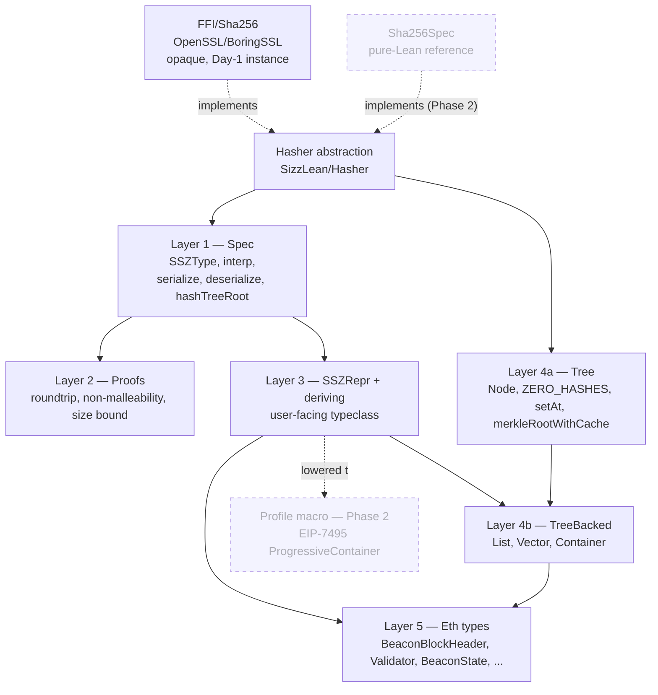
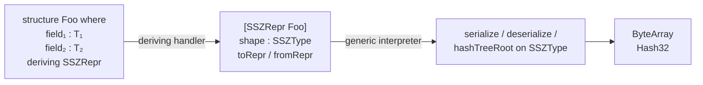
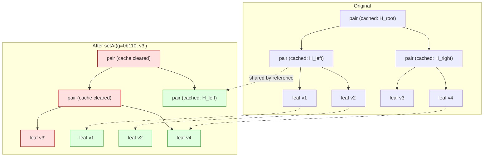

# SizzLean: Architecture

## 1. Context

SizzLean is a Lean 4 library implementing Ethereum's [SSZ](https://github.com/ethereum/consensus-specs/blob/dev/ssz/simple-serialize.md)
(Simple Serialize): serialization, deserialization, Merkleization,
the `SSZRepr` typeclass + deriving handler, the cached Merkle-tree
layer, the `sszUpdate` macro, and the FFI-backed `Hasher Sha256`
instance. It is one of three sibling subpackages in the *Etheorem*
monorepo at the repo root (see `../../../README.md` and
`../../../docs/monorepo-arch.md`).

The goal is a faithful, formally verified encoder / decoder /
merkleizer, *one* set of proofs that every Ethereum consensus
type can inherit, plus a production-grade hash-tree-root path that
runs fast enough to be useful in real workloads.

## Other subpackages, in terms of what SizzLean needs from them

* **`LeanSha256`**: sibling subpackage at
  `../../LeanSha256/`. Provides the pure-Lean SHA-256 reference
  used by SizzLean's kernel-reducible `Hasher Sha256Spec`
  instance bridge (`packages/SizzLean/SizzLean/Hasher/Sha256Spec.lean`).
  SizzLean's `[[require]] LeanSha256` declaration is in
  `packages/SizzLean/lakefile.lean`.

* **`EthCLLib` / `EthCLSpecs`**: sibling subpackages at
  `../../EthCLLib/` and `../../EthCLSpecs/`. `EthCLLib` is the
  consensus-spec framework on top of SizzLean; `EthCLSpecs` holds
  the Fulu/Gloas specs and declares its consensus containers
  in-spec, `deriving SSZRepr` against the types and instances
  SizzLean exports. The arrangement validates that SizzLean's user
  surface is enough to express every consensus container without
  ad-hoc edits to the library. They don't appear elsewhere in this
  document except as the existence proof for the "scales to
  BeaconState" claim.

This document binds the design of the SizzLean library. It distils the
two research artefacts under
[`research/`](research/), `pre-research.md` (the design space and
proof strategy) and `cache-research.md` (the persistent-tree cache layer),
into the layered module organisation, the trust boundary, the user-facing
API surface, and the implementation sequencing. A companion document
[`OPTIMISATION.md`](OPTIMISATION.md) carries the implementation-level
detail for Layer 4: exactly how the cache is wired in code, plus the
plans for the open Stage 17 performance sub-stages (with pointers to
the `remerkleable` / Lighthouse / Lodestar patterns each one lifts).

**Our approach**, drawn from the analysis in `pre-research.md`, is to
reflect the SSZ grammar into Lean as data (a `SSZType` inductive), write
encode / decode / merkleization once as a recursion on that data, and
expose user types via a small typeclass `SSZRepr` synthesised by a
`deriving` handler. The key consequence is that the three central
correctness theorems (roundtrip, non-malleability, length bound) are
proved *once*, on the universe. Every user type with a `deriving SSZRepr`
line then inherits a one-line corollary without writing a new proof.
Vanilla Lean structures cover every consensus type from `phase0` through
`gloas`, so we do not build the **Approach C** `profile%` macro
front-end that would otherwise lower EIP-7495 ProgressiveContainer
profiles; see §8 for the rationale and the re-introduction recipe if a
future fork adopts EIP-7495. The cached Merkle-tree layer sits
orthogonally on top of the universe as a production fast path, asserted
equivalent to the verified spec rather than formally verified itself.

The doc is written to be readable from both ends: a Lean-fluent reader who
has not internalised the SSZ wire format, and an SSZ-fluent reader who has
not written Lean. Where either side names something the other has not seen,
the first occurrence is glossed and the rest of the document proceeds.
This mirrors CLAUDE.md's "Literate by default" stance and is binding on
the implementation files this document plans, not just on the document.

## 2. Architecture at a glance

The library is organised in five layers with one cross-cutting library.
Dependencies flow top-to-bottom; nothing in a lower layer imports anything
from a higher one.



**What our approach buys.** Three behavioural properties carry the library:
"decoding the encoding of any value yields that value", "two distinct values
never serialise to the same bytes", and "the encoded size never exceeds a
static bound". Each is stated once on `SSZType` and proved once by induction. User
types reach those theorems through a free isomorphism. The library scales
to BeaconState without scaling its proof obligation.

In practice, the proofs widen one constructor at a time. PLAN.md
Stages 5–6 shipped the proof *infrastructure* (`@[ssz_simp]` set,
`Supported` predicate, `BasicSupported` dispatch) plus a narrow
first cut; Phase 3 validated the implementation empirically against
the official `ethereum/consensus-spec-tests` release vectors;
Phase 4 built the performance layer on top of the now-known-good
library; **Phase 5 (Stage 18) widens the three theorems** toward
universal `Supported` coverage. As of this writing
`BasicSupported` covers `uintN 8/16/32/64`, `bool`, fixed-size
`vector` and `list`, and `container` over fixed-size fields
(recursively). See `Spec/BasicSupported.lean` and the
README's *Proof coverage* table. `bitvector`, `bitlist`, and
mixed-field containers remain open; the `SSZ.roundtrip`
user-surface corollary is gated by `BasicSupported r.shape` until
those land. The asterisk on "verified by inheritance" is
intentional and small: passing empirical conformance is what
makes both the performance investment in Phase 4 and the
research-grade proof investment in Phase 5 well-targeted rather
than speculative.

**What the cache layer adds.** SSZ's `hash_tree_root` is the dominant cost
in any consensus-state pipeline: a cold root of `BeaconState` hashes tens
of megabytes of leaves plus the entire log₂ tree above. Layer 4 represents
state as a persistent binary Merkle tree with one cache slot per interior
node; mutation produces a new tree sharing all off-path subtrees by
reference, and re-hashing walks only the dirty spine. This is a near
line-for-line port of `protolambda/remerkleable`'s `PairNode` design, with
Lean's reference-counting runtime giving the structural sharing for free.

**Why Approach C is unplanned.** EIP-7495 ProgressiveContainer
profiles carry information (active-fields bitvectors, profile
inheritance, manually-pinned generalized indices) that does not fit a
vanilla Lean `structure`. A surface macro would be the right tool
*when that case enters scope*. As of v1.5.0 and consensus-specs `dev`
head it has not: `phase0` through `gloas` use only plain `Container`,
so the `progContainer` / `stableContainer` / `union` / `progList`
/ `progBitlist` / `compatUnion` constructors are themselves not
present in `SSZType`. `deriving SSZRepr` on a normal `structure` is
the entire user surface. See §8 for the full rationale and the
re-introduction recipe.

## 3. Layer 1: Spec (`packages/SizzLean/SizzLean/Spec/`)

**Purpose.** The formal source of truth. Every behavioural property of the
library is stated on this layer; everything else either inherits a proof
through `SSZRepr` (Layer 3) or is asserted equivalent and validated
empirically (Layer 4).

Each file in `Spec/` opens with a `/-! … -/` module docstring (Lean's
syntax for module-level prose) naming the consensus-specs SSZ section it
implements: `Spec/Type.lean` mirrors *§SSZ Types*, `Spec/Serialize.lean`
mirrors *§Serialization*, and so on. Every public definition carries a
`/--` declaration docstring giving the *why*; where the *what* is non-
trivial against the spec, a one-line spec-pseudocode excerpt is welcome.

### 3.1 The type universe

The SSZ grammar is reflected as a Lean `inductive`, an algebraic data
type whose constructors enumerate the kinds of SSZ values:

```lean
inductive SSZType where
  | uintN     : (bits : Nat) → SSZType         -- bits ∈ {8,16,32,64,128,256}
  | bool      :                  SSZType
  | vector    : SSZType → Nat  → SSZType        -- element type, length
  | list      : SSZType → Nat  → SSZType        -- element type, capacity
  | bitvector : Nat            → SSZType
  | bitlist   : Nat            → SSZType
  | container : List SSZType   → SSZType
  deriving Hashable
```

A `SSZType` value is itself plain Lean data: comparable, hashable, useful
for fuzzing against an external oracle.

**Intentionally omitted.** The SSZ spec also defines `Union[T₁, …, Tₙ]`,
`ProgressiveContainer(active_fields=[…])` and `StableContainer[N]` /
`Profile` (EIP-7495), `ProgressiveList[T]` / `ProgressiveBitlist`
(EIP-7916), and `CompatibleUnion({sel: type, …})` (EIP-8016). **No
consensus type from `phase0` through `gloas` uses any of these.**
Every container in the mainline + experimental forks (including
`eip7732` / `eip7441`) is a plain `Container`; no fork uses `Union`.
Carrying the unused constructors would inflate every match expression
and every proof obligation for zero conformance benefit. The universal
proofs in Phase 5 (Stage 18) have a smaller surface as a result.

If a future fork adopts any of these forms, re-add the constructor
plus its `serialize` / `deserialize` / `hashTreeRoot` / `Supported`
arms. The `profile%` macro front-end (§8) would also land at that
point. Until then, it stays unbuilt.

### 3.2 Interpretation: from descriptions to Lean types

Each constructor maps to the Lean type its values inhabit:

```lean
def SSZType.interp : SSZType → Type
  | .uintN 8       => UInt8     | .uintN 16 => UInt16
  | .uintN 32      => UInt32    | .uintN 64 => UInt64
  | .uintN n       => BitVec n
  | .bool          => Bool
  | .vector t n    => Vector t.interp n
  | .list t cap    => { xs : Array t.interp // xs.size ≤ cap }
  | .bitvector n   => BitVec n
  | .bitlist cap   => { bs : Array Bool   // bs.size ≤ cap }
  | .container fs  => HList SSZType.interp fs
  | ...
```

`{ x // p x }` is Lean's anonymous-subtype syntax: a pair of a value and a
proof that the predicate holds, with the proof erased at runtime. `Vector
α n` is Lean core's length-indexed array (since 4.10+), a structure that
already contains a length proof and supports `xs[i]` indexing, so it is
reused directly rather than rebuilt. `HList` (heterogeneous list) is the
standard encoding for a tuple whose element types vary per index, which is
what a container's mixed-type fields require.

### 3.3 The three operations

```lean
def serialize    : (s : SSZType) → s.interp → ByteArray
def deserialize  : (s : SSZType) → ByteArray → Except SSZError (s.interp × Nat)
def hashTreeRoot [Hasher H] : (s : SSZType) → s.interp → ByteArray
```

Each is a single recursion on `SSZType`, matching the spec's pseudocode
line-for-line. The `container` case has a well-foundedness obligation,
since the recursive call descends into a `List SSZType` rather than a structural
subterm. It is discharged with `decreasing_by` plus `List.sizeOf_lt_of_mem`.
Lean 4.11+'s mutual structural-recursion machinery makes this routine; no
`partial def` is needed and none is used.

`hashTreeRoot` is parameterised by `[Hasher H]` (Lean's instance-implicit
binder, requesting a typeclass instance at the call site). On Day 1 the
sole instance is the `@[extern] opaque` FFI shim: SHA-256 is treated as
opaque inside the kernel, asserted equal to NIST SHA-256 by validating
CAVP test vectors at build time. The three central theorems (§4) don't
touch hashes, so opacity costs nothing for them. A pure-Lean `Sha256Spec`
is a Phase-2 hardening item that, when written, upgrades the FFI
assertion to a kernel-checked equality. See §9.

### 3.4 Files

| File | Role |
| --- | --- |
| `Spec/Type.lean`        | `inductive SSZType` plus `DecidableEq` / `Hashable`. |
| `Spec/Interp.lean`      | `def SSZType.interp : SSZType → Type`. |
| `Spec/Constants.lean`   | `BYTES_PER_CHUNK = 32`, `BYTES_PER_LENGTH_OFFSET = 4`, `MAX_LENGTH = 2^32`. |
| `Spec/Serialize.lean`   | Total `serialize` by recursion on `SSZType`. |
| `Spec/Deserialize.lean` | Total `deserialize` returning `Except SSZError`. |
| `Spec/HashTreeRoot.lean`| Total `hashTreeRoot` parameterised by `[Hasher H]`. |

## 4. Layer 2: Proofs (`packages/SizzLean/SizzLean/Proofs/`)

Three central theorems anchor the library, one per file:

```lean
/-- Decoding the encoding of any value yields that value, with no leftover bytes. -/
theorem decode_encode :
    ∀ (s : SSZType) (x : s.interp),
      deserialize s (serialize s x) = .ok (x, (serialize s x).size)

/-- Two distinct values never serialise to the same bytes (non-malleability). -/
theorem serialize_injective :
    ∀ (s : SSZType) (x y : s.interp), serialize s x = serialize s y → x = y

/-- The serialised size never exceeds a static, type-determined bound. -/
theorem encode_size_le_max :
    ∀ (s : SSZType) (x : s.interp), (serialize s x).size ≤ s.maxByteLength
```

Each is one induction on `SSZType`. The tactic vocabulary:

- `simp` with a tagged `ssz_simp` set on every `serialize`/`deserialize`
  equation (declared in `Proofs/Simp.lean`), keeping the inductive cases
  closing uniformly.
- `omega` for `Nat` / `Int` arithmetic on offsets and lengths.
- `bv_decide` (built into Lean since 4.12; reduces `BitVec` goals to SAT
  via CaDiCaL) for endianness and bit-packing lemmas.
- `induction` on `SSZType`, `split` to peel apart nested matches in
  `deserialize`, `Aesop` with a small custom rule set for trivial cases.
- `decide` for closed finite goals; `native_decide` reserved for the
  conformance suite (each invocation adds a `Lean.ofReduceBool` axiom in
  Lean 4.29+, kept off the trusted core).

Per `pre-research.md` §7, **Layers 1 and 2 must be complete and proved
before Layer 3 ships.** The whole value proposition is that user types
inherit correctness for free. That requires the generic interpreter to
already be correct. There is no parallelisable speedup here; the proofs
are the deliverable.

The non-malleability theorem (`serialize_injective`) is the highest-
impact publishable artefact in the library: SSZ guarantees it
implicitly by construction (canonical little-endian, monotonic offsets,
minimal bitlist trailing-bit, no extra bytes), but no implementation has
ever proved it. Stating, proving, and shipping it as a Lean 4 artefact is
the standard the EF should hold itself to and is worth aiming at a
top-tier security venue on its own merits.

## 5. Layer 3: `SSZRepr` and the deriving handler (`packages/SizzLean/SizzLean/Repr/`)

This is the layer the library's users actually touch.

### 5.1 The typeclass

```lean
class SSZRepr (T : Type) where
  shape    : SSZType
  toRepr   : T → shape.interp
  fromRepr : shape.interp → T
  to_from  : ∀ x, fromRepr (toRepr x) = x
  from_to  : ∀ r, toRepr (fromRepr r) = r
```

A `SSZRepr T` instance carries a *shape* (the `SSZType` description that
classifies `T`'s wire format), an isomorphism between `T` and that
shape's interpretation, and proofs that the isomorphism is genuine. Per-
user-type `serialize`, `deserialize`, and `hashTreeRoot` are then thin
wrappers:

```lean
def SSZ.serialize    [r : SSZRepr T] (x : T) : ByteArray := Spec.serialize    r.shape (r.toRepr x)
def SSZ.deserialize  [r : SSZRepr T] (b : ByteArray) : Except SSZError T :=
  match Spec.deserialize r.shape b with
  | .ok (y, _) => .ok (r.fromRepr y) | .error e => .error e
def SSZ.hashTreeRoot [r : SSZRepr T] [Hasher H] (x : T) : ByteArray :=
  Spec.hashTreeRoot r.shape (r.toRepr x)
```

Per-user-type roundtrip is a one-line corollary:

```lean
theorem SSZ.roundtrip [r : SSZRepr T] (a : T) :
    SSZ.deserialize (SSZ.serialize a) = .ok a := by
  simp [SSZ.serialize, SSZ.deserialize, decode_encode, r.from_to]
```

That `from_to` field is what closes the proof: it converts the round-
tripped representation `r.toRepr (r.fromRepr ...)` back to the user type.
This is the single architectural payoff that makes the universe approach
worth the indirection.

### 5.2 The `deriving` handler

`Repr/Deriving.lean` is the densest metaprogramming file in the project
and the only metaprogramming the library needs. It registers a handler
for the `SSZRepr` class that:

1. Walks each user `structure`'s fields with `getStructureFields`.
2. Looks up `SSZRepr.shape` on each field's type via `synthInstance?`
   (typeclass synthesis at elaboration time), emitting a precise error if
   any field type lacks an instance.
3. Assembles the matching `SSZType.container [...]` description.
4. Emits the `toRepr` / `fromRepr` isomorphism plus `rfl` proofs of the
   two laws (the structure-to-`HList` round trip is definitionally equal
   to the identity, so `rfl` discharges both).

The canonical templates to follow are Lean core's
`src/Lean/Elab/Deriving/Repr.lean` (137 lines, fully verified, the
cleanest existing handler) and `src/Lean/Elab/Deriving/FromToJson.lean`
(the encode/decode-pair pattern). The handler's module docstring will
walk a first-time reader through `registerDerivingHandler`,
`getStructureFields`, `synthInstance?`, and `forallTelescopeReducing`,
all standard Lean meta-programming idioms that are completely opaque
without context.

`Repr/Instances.lean` ships library-provided instances for the primitives
and composites: `UInt8/16/32/64`, `Bool`, `BitVec n`, `Vector α n`,
`SSZ.List α n`, `Bitvector n`, `Bitlist n`, sigma-typed unions. The
deriving handler always has the leaves it needs to recurse on.

### 5.3 The user surface



A complete user-side example, lifted directly from the consensus spec:

```lean
import SizzLean

structure BeaconBlockHeader where
  slot          : Slot
  proposerIndex : ValidatorIndex
  parentRoot    : Root
  stateRoot     : Root
  bodyRoot      : Root
  deriving SSZRepr

structure Validator where
  pubkey                       : BLSPubkey
  withdrawalCredentials        : Bytes32
  effectiveBalance             : Gwei
  slashed                      : Bool
  activationEligibilityEpoch   : Epoch
  activationEpoch              : Epoch
  exitEpoch                    : Epoch
  withdrawableEpoch            : Epoch
  deriving SSZRepr

/-- An `example` block keeps the round-trip honest under the typechecker:
    if the deriving handler ever produces a wrong iso, the build breaks here. -/
example (h : BeaconBlockHeader) :
    SSZ.deserialize (SSZ.serialize h) = .ok h := SSZ.roundtrip h
```

That is the entire user surface: one keyword per type, no manual
instances, no boilerplate. Every consensus type from Phase 0 through
Electra fits this shape. The `example` block is part of the discipline:
each user-facing API gets a typechecker-honest example in source, per
CLAUDE.md's literate-by-default principle.

### 5.4 Files

| File | Role |
| --- | --- |
| `Repr/Class.lean`     | `class SSZRepr T` plus thin user-facing wrappers `SSZ.serialize` / `SSZ.deserialize` / `SSZ.hashTreeRoot` and the `SSZ.roundtrip` corollary. |
| `Repr/Instances.lean` | `SSZRepr` instances for primitives (`UInt8/16/32/64`, `Bool`, `BitVec`) and composites (`Vector`, `SSZ.List`, `Bitvector`, `Bitlist`). |
| `Repr/Deriving.lean`  | The `registerDerivingHandler` that synthesises `SSZRepr` for any user `structure`. |

## 6. Layer 4: Cached Merkle tree (`packages/SizzLean/SizzLean/Cache/`)

**Purpose.** Make `hash_tree_root` fast enough for production. In Layer 1
the spec `hashTreeRoot` recomputes from scratch every call: hashing
~41 MB to root a `BeaconState`. Layer 4 represents the same value as a
persistent binary tree with cached hashes per interior node, structural
sharing on update, and re-hashing only the dirty spine after a mutation.

This layer is *intentionally outside* the formal-verification frontier.
The cache is asserted equivalent to the spec, validated empirically by
the `ssz_generic` conformance vectors plus a property test, and exposed
to users behind a separate type (`TreeBacked T`) so that holding a plain
`T` and calling the verified `SSZ.hashTreeRoot` remains an option per
use-site.

> **Implementation-level docs.** This section gives the
> architectural picture: types, key operations, the wrapper, the
> file layout. The corresponding *implementation* docs live in
> [`OPTIMISATION.md`](OPTIMISATION.md): exactly how each piece is
> wired in code, plus the more detailed plans for the open Stage 17
> performance sub-stages (deferred-update overlay, batched SHA-256,
> hash-consing, profile-guided `@[specialize]`, serialised-form
> caching) and which patterns we lift from `remerkleable` /
> Lighthouse / Lodestar. Read that document
> alongside this section when working on the cache.

### 6.1 Core types

```lean
inductive Node where
  | leaf : ByteArray → Node                          -- 32 bytes; leaf or summary
  | pair : Node → Node → Option ByteArray → Node     -- left, right, cached root
  deriving Inhabited
```

The `Option ByteArray` on `pair` is the cache slot, a direct analogue
of remerkleable's `root: Optional[Root]`. A `pair` cell is a 3-pointer
heap record; the discriminator is a tag bit on the constructor. A
`leaf`'s "cache" is its own bytes, so `Node.cached` returns `some`
for either constructor. This is the same pattern Lean core's
`Lean.Expr` uses internally with its 64-bit `Expr.Data` cached hash.

`Node` has no laziness baked into it; the inductive is just two
strict constructors. The cache layer keeps tree-shape construction
*off the hot path* by wrapping the whole tree in `Lean.Thunk` one
level up, `TreeBacked.treeBase : Thunk Node` (see §6.3). That
`Thunk` is the single point where deferral lives: `TreeBacked.ofValue`
sets it to `Thunk.mk (fun _ => Node.ofShape …)` and the first
`hashTreeRoot` call forces it. After the first force, `Thunk`'s
built-in memo makes every subsequent read O(1) at the top.

Per-`sszUpdate` writes don't enter the tree at all until commit
time; they accumulate in a separate `pending` overlay as
closures (see §6.3 below). The "no `Node`-shaped work happens
until `merkleRoot` walks the tree" invariant therefore lives at
the `TreeBacked` level, not on the `Node` inductive itself.

The pair builders in `Cache/MerkleTree/Build.lean` (`Node.ofLeaves`,
`Node.ofSubtrees`, `Node.mixInLength`) embed the
parent's root inline at construction (`.pair l r (some root)`,
with `root` computed via `Node.rootOf` on the freshly-built
children). A subsequent `merkleRootWithCache` on a fresh
`Node.ofShape` output therefore short-circuits in O(1) at the top
pair without redoing the depth-first hash walk.

The single optimisation that makes a `List[Validator, 2**40]`
tractable is precomputing zero-subtree hashes. The table is built
once at module load via direct `sha256Combine` FFI calls:

```lean
private def zeroHashRec : Nat → ByteArray
  | 0     => zero32
  | d + 1 => let z := zeroHashRec d; sha256Combine z z

private initialize zeroHashesRef : IO.Ref (Vector ByteArray 65) ←
  IO.mkRef (Vector.ofFn (fun (i : Fin 65) => zeroHashRec i.val))

@[implemented_by zeroHashesUnsafeImpl]
private def zeroHashes : Vector ByteArray 65 :=
  Vector.ofFn (fun (i : Fin 65) => zeroHashRec i.val)

def zeroHashAt (H : Type) [Hasher H] (d : Nat) : ByteArray :=
  if h : d < 65 then zeroHashes.get ⟨d, h⟩ else zero32
```

The runtime body of `zeroHashes` (swapped in via `@[implemented_by]`)
reads from the `initialize`-populated ref via `unsafeBaseIO`; the
kernel-visible body is the pure recurrence. The `[Hasher H]`
parameter on `zeroHashAt` is vestigial. It is kept so callers'
signatures don't change and ignored by the body, because by the
`sha256Combine_eq_spec` axiom the memoised Sha256 table values
equal any equivalent hasher's recurrence output.

A 2⁴⁰-leaf list with one entry populated holds 40 real `pair`
nodes on the populated path and a single shared `zeroLeaf` per
depth above, for `O(populated + depth)` storage, not `O(2^40)`.

### 6.2 The two key operations

`merkleRootWithCache` is the lazy-evaluation variant: it returns both the
root hash and a new `Node` with caches filled on the walked spine. The
caller threads the new `Node` back into the enclosing `TreeBacked`, so a
subsequent root request hits the cache.

```lean
def Node.merkleRootWithCache : Node → ByteArray × Node
  | .leaf b              => (b, .leaf b)
  | .pair l r (some c)   => (c, .pair l r (some c))
  | .pair l r none       =>
      let (lh, l') := l.merkleRootWithCache
      let (rh, r') := r.merkleRootWithCache
      let h := sha256Combine lh rh
      (h, .pair l' r' (some h))
```

`setAt` updates one leaf at a *generalized index* (gindex). A gindex is
the SSZ spec's address for a tree node: bits after the leading 1-bit
encode the descent: `0` means *go left*, `1` means *go right*. So
`g = 0b1_011` is "from the root, take right, then left, then right".
`Cache/MerkleTree/SetAt.lean` is the highest-risk file in the project, since gindex
arithmetic was Nimbus's February-2025 mainnet-fork failure mode. Its
module docstring will spell the convention out with a worked example,
and the recursion runs over an explicit `List Bool` of bits rather than
bit-twiddling on `Nat`. The Lean type system and the structural recursion
make the off-by-one errors that bit Nimbus unrepresentable rather than
merely tested.



One leaf update on a 2⁴⁰-list = 41 fresh `pair` allocations + 0 SHA-256
calls. Hashing happens lazily on the next root request and walks only
the dirty spine because every off-path node still carries its cached
root. This is the entire production-performance argument for the layer.

#### Fused commit + root walk: `Node.commitAndHash`

`setManyAt` followed by `merkleRootWithCache` would walk the
touched spine *twice*: once to install the new sub-trees
(allocating `.pair _ _ none` cells along the way), once to fill
the cache slots (re-allocating those same cells with `(some r)`).
`Node.commitAndHash` fuses both into one walk: each touched spine
cell is allocated once, with its root computed inline.

```lean
def Node.commitAndHash (H : Type) [Hasher H] :
    Node → List (List Bool × Node) → ByteArray × Node
```

The caller passes a list of `(gindex-bits, subtree)` updates.
For each level along the touched spine, `commitAndHash` partitions
the updates by their next path-bit, recurses on the affected
child only (untouched children return their existing root via
`Node.rootOf`: O(1) when the cell is cached, O(depth) otherwise),
and combines via `Hasher.combine` to produce the parent's root.
The freshly built `.pair l r (some root)` is what the caller
keeps. New sub-trees supplied via `updates` come pre-cached (from
`Node.ofShape`'s embedded cache slots), so `rootOf` on them is
O(1) at the top.

`commitAndHash` is what `TreeBacked.hashTreeRootCached` calls
when the pending overlay has writes; for an overlay with zero
writes it falls through to plain `merkleRootWithCache`.

### 6.3 The `TreeBacked` wrapper

```lean
def PendingWrite (T : Type) : Type := T → Option Node

structure TreeBacked (H : Type) (T : Type) [Hasher H] [SSZRepr T] where
  view     : T                                          -- always current
  treeBase : Thunk Node                                 -- deferred until first root
  pending  : Std.TreeMap Nat (PendingWrite T) := {}     -- accumulated writes

/-- Public-facing alias. Reads as a value-level abstraction without
exposing the Merkle-tree mechanism. -/
abbrev CachedSSZ (H T : Type) [Hasher H] [SSZRepr T] := TreeBacked H T
```

The structure has three fields, each with a distinct role:

* **`view`**: the user-observable Lean value, kept in lock-step
  with `pending`. Every `sszUpdate` write updates `view` eagerly,
  so `box.view.someField` reads always reflect the latest value
  the user wrote. This is what `sszGet` projects through.
* **`treeBase`**: the Merkle-tree backing, *before* the pending
  overlay is applied. Wrapped in `Thunk` so the initial
  `Node.ofShape` build is deferred to the first `hashTreeRoot`
  call. After the first walk, `treeBase` holds a `Thunk.pure
  cachedTree` whose top-level `.pair _ _ (some r)` short-circuits
  in O(1) on every subsequent read.
* **`pending`**: a `Std.TreeMap` keyed by gindex, accumulating
  writes between commits. Each entry is a `PendingWrite T`
  closure (= `T → Option Node`) that, at commit time, projects
  the relevant sub-value out of the **current** `view` and builds
  the matching sub-tree via `Node.ofShape`. Reading from `view`
  at commit (rather than capturing the value at insert time) is
  what keeps overlapping parent/child writes mutually consistent:
  a parent's closure naturally sees every later child override
  via the shared `view`. The closure returns `Option Node` so
  that writes which turned out to be view-side no-ops (most
  commonly an `xs[i] := v` whose `i` was out-of-bounds, where `Array.set!`
  silently leaves the array unchanged) can signal `none` and be
  dropped at commit without touching the tree.

`TreeBacked.hashTreeRootCached` consults `pending` first: each
closure runs against `view`, surviving entries (those that
returned `some`) are passed as `(gindexBits, Node)` updates to
`Node.commitAndHash` (§6.2), and the returned cached tree
replaces `treeBase` for the next commit's starting point.

The hasher `H` is part of the *type*: the tree's cache slots were
filled with `H`'s `combine` operation, and every downstream update
must use the same `H` to keep the cache in sync with the spec's
root. Pinning `H` in the type makes "mix hashers within one cached
value" a *type error* rather than a silent root mismatch. The
user picks `H` once, at `TreeBacked.ofValue` time, and downstream
`sszUpdate` / `hashTreeRootCached` calls infer it.

`H` is the *first* parameter so a particular hasher can be
partially applied to yield a single-arg type constructor, so the
common case of "fix one hasher across many content types" becomes
`abbrev Sha256Cached (T : Type) [SSZRepr T] := CachedSSZ Sha256 T`.

The two type names are *the same type* (`CachedSSZ` is an `abbrev`
over `TreeBacked`). `TreeBacked` is the *internal* spelling used
inside `packages/SizzLean/SizzLean/Cache/TreeBacked.lean` where the Merkle tree is
load-bearing (gindex paths, `setManyAt` walker, cache slots);
`CachedSSZ` is the *external* spelling the library presents to
users who care about "a cached SSZ value" and not the underlying
tree. The update surface `sszUpdate` lives under `packages/SizzLean/SizzLean/Cache/`
because it works on both production (`CachedSSZ`, Merkle-tree
cached) and proof (`UncachedSSZ`, no cache). The elaborator
inspects the base term's type at expansion time and emits the
shape each flavour needs (cached: a `Node.setManyAt`-based spine
update; uncached: a plain `{ view := … }` struct rewrite).

For code that needs to abstract over *both* flavours in one
function body, the library exposes `SSZ.Box H T` (in
`Cache/Box.lean`), a closed inductive with two constructors
(`.cached` / `.uncached`) wrapping `CachedSSZ H T` and
`UncachedSSZ H T` respectively. Spec functions that should serve
both runtime and proof callers take `(s : SSZ.Box H T)` as a
parameter and use `sszGet s …` / `s.hashTreeRoot` / `sszUpdate s with
…` uniformly; the `sszUpdate` macro recognises the type and emits
a two-arm match that dispatches to the per-flavour update path.
The constructors are private. User code reaches the type through
four smart constructors: `SSZ.FastBox v` / `SSZ.PureBox v`
(Sha256-pinned), `SSZ.CachedBox H v` / `SSZ.UncachedBox H v`
(hasher-explicit). All four return `SSZ.Box H T` so they are
substitutable at a single call site.

A library user can write the entire end-to-end flow without ever
typing the word "tree":

```lean
let c : CachedSSZ Sha256 Fork := CachedSSZ.ofValue Sha256 v
let c' := sszUpdate c with epoch := newE
let root := c'.hashTreeRoot
```

`CachedSSZ.ofValue` is the user-facing alias for
`TreeBacked.ofValue`; it constructs the cache backing and is the
*one* point where the user names `H`. After construction, the
type carries `H` through every operation; `s.hashTreeRoot` is
the suffix-free user alias for the internal `hashTreeRootCached`.

The coherence between `view` and `tree` (`view ≡ fromRepr (decodeTree
tree)`) is maintained by the smart constructors and *not* stated as a
Lean proposition. Per cache-research.md §5, the cache layer is
intentionally outside the formal-verification frontier; its safety net is
the `ssz_generic` conformance suite plus a property test
(`∀ t : TreeBacked T, hashTreeRootCached t = SSZ.hashTreeRoot t.view`).

The single `TreeBacked H T` shape (any `T` with `[SSZRepr T]`)
provides the cached fast path with `O(depth)` `set` / `append` /
`hashTreeRoot` via the `sszUpdate` macro and the `setManyAt`
walker. Separate `TreeBacked.List` / `TreeBacked.Vector` /
`TreeBacked.Container` headers planned in an earlier draft were
collapsed into the single tree-shaped representation. The user
opts in by constructing a `CachedSSZ.ofValue Sha256 v` (or
wrapping with `SSZ.FastBox v` for the `SSZ.Box`-typed parameter
form) and operates on the tree-backed value; opting out is just
holding a plain `T` and calling the verified spec: no global
flag, no API divergence beyond the type at the use site.

**Transparent-optimisation strategy.** All performance levers on
the cached path are configured at *construction* (`SSZ.FastBox`
/ `CachedSSZ.ofValue`) and then engage automatically through the
unchanged user surface (`box.hashTreeRoot`, `box.serialize`,
`sszUpdate`). Concretely:

* **On by default** (pay nothing extra to opt in): the pending
  overlay (closures keyed by gindex in `TreeBacked.pending`), the
  `Thunk Node` initial-construction deferral in
  `TreeBacked.treeBase`, the fused commit + root walk
  (`Node.commitAndHash`, §6.2), the pre-cached `Node.ofShape`
  builders (§6.1), `serialiseThunk` memoisation, and `@[specialize]`
  hints on the deriving handler. Together these realise the
  invariant *"no `Node`-shaped work happens until `hashTreeRoot`
  walks the tree"*: nothing in the cache layer calls
  `Node.ofShape` or `Hasher.combine` outside the commit walk.
* **On by default after 17b.1 + 17b.2 land**: batched SHA-256
  through the level-aware traversal: same `box.hashTreeRoot`
  call, faster underneath. The cross-platform SIMD shim
  (Stage 17b.1) keeps the Lean surface and the trust boundary
  identical across architectures.
* **Off by default when integrated** (explicit opt-in at
  `Box` construction): hash-consing (Stage 17c). The standing
  micro-bench evidence is that the typical workload (one
  resident state, no inter-tree subtree redundancy) pays a
  ~9× per-root penalty for consing. The fix is the same shape
  the user already uses for `H`: pick at construction, then
  forget. The default `SSZ.FastBox v` remains consing-off; an
  opt-in constructor variant (e.g. `SSZ.FastBox v
  (consing := true)`) is what archival / gossip-aggregation
  callers reach for.

The principle: the user picks `H` and any opt-in optimisations
once at construction; downstream code uses uniform method names
without knowing which levers are active.

#### Ergonomic read / update surface (`sszGet` / `sszUpdate`)

User code reaches the boxed value's contents through a pair of
macros that share the same dotted-and-indexed path syntax. The
read direction `sszGet b a.b[i].c` expands purely
syntactically to `b.view.a.b[i].c`. The write direction
`sszUpdate t with f.g := v, h := w` expands into one of the
cache-specialised update emissions described below. Both macros
read or write the same field with identical paths apart from the
keyword and the `:= value` clause; user code never has to type
`.view` (the internal projection on `Box` / `CachedSSZ` /
`UncachedSSZ`).

`sszGet` is a one-line `macro_rules` rewrite in `Cache/Update.lean`;
the resulting term is just a chain of Lean's standard `.field`
and `[i]` accessors, so `rfl` / `decide` / `simp` proofs close
transparently. The setters that Stage 14c shipped by hand
(`Fork.setEpoch`, `HistoricalBatch.Minimal.setBlockRoot`) were
mechanical: each one computes a gindex from the field's position
in the structure, calls `Node.ofShape` to build the replacement
sub-tree, and splices it in with `Node.setAt`. Stage 14d collapses
that boilerplate on the write side into a single user-facing
syntax:

* **`sszUpdate t with dotted.path := value, …`** is the recommended
  way to write any SSZ field update. `H` is *not* written at the
  call site; the elaborator reads it from `t`'s cache type
  (`CachedSSZ H T` or `UncachedSSZ H T`). The term elaborator in
  `Cache/Update.lean` walks the structure-field reflection at
  expansion time and emits one of two specialised forms based on
  which cache type the base has:
  * **Cached path.** Composes path bits across each level of
    nesting and emits a single `Node.setManyAt` call (in
    `Cache/MerkleTree/SetAt.lean`) that partitions the writes by first
    path-bit and allocates one fresh `pair` per *level of shared
    spine* instead of one fresh spine per write. For a multi-field
    update on a container with depth `d`, this drops the
    allocation count from `k·d` to roughly `d + k·(d −
    sharedDepth)`.
  * **Uncached path.** Emits a plain `{ view := { t.view with f :=
    v, … } }` struct rewrite. No Merkle vocabulary appears in the
    emission. Basic-packed element indexing (`Vector UInt64 n[i]`
    etc.) is *allowed* on this path; the cached path's chunk-
    rebuild restriction doesn't apply.

Per-statement batching ships in 14d; cross-statement batching
(accumulating writes across many `let mut t := …; sszUpdate t with
…` statements into one commit) is the deferred-update overlay in
Stage 17a.

Index syntax is supported: `sszUpdate t with blockRoots[i] := r`
descends into `Vector` or `SSZList` fields, with the runtime
gindex computed at the index expression and the surrounding path
bits baked as literals at expansion time. Lists carry the
`[false]` mix-in-length prefix automatically. The element type
must be composite (a structure or a nested `Vector`/`SSZList`);
basic packed elements (e.g. `Vector UInt64 n`, `SSZList Gwei n`)
are rejected at expansion time, since they require a chunk-rebuild
path the flat macro doesn't ship.

For basic-packed fields, the current workaround is whole-vector /
whole-list replacement:

```lean
-- Instead of `sszUpdate state with balances[i] := newBal` (rejected):
sszUpdate state with balances := state.view.balances.set! i newBal
```

Cost: O(cap) merkleization, where `Node.ofShape` rebuilds the whole
`balances` subtree from scratch on every call, rather than the
O(log cap) cache-aware path. Acceptable for one-off updates;
impractical for state-transition loops that touch many basic-packed
elements per slot. Basic-packed indexing is a planned Sub-F follow-
up, gated on measured need.

An earlier draft also shipped a `derive_tree_setters T` command
macro that emitted one `T.setField` `def` per structure field. It
was removed: the named setters were a strict subset of `sszUpdate`'s
capability, and chaining them for multi-field updates is actively
*worse* than the single-`sszUpdate` call (every chained call
re-walks the spine and clears the cache on every off-target
sibling, the exact failure mode `setManyAt` was built to avoid).
Use `sszUpdate` for any in-cache field update; for first-class
function values, write `fun t v => sszUpdate t with f := v` at
the use site.

With index syntax now covered, `TreeBacked/Container.lean` (which
hosted the hand-written `HistoricalBatch.Minimal.setBlockRoot`
nested vector setter) has been retired entirely; `sszUpdate t
with blockRoots[i] := r` replaces it directly.

The `sszUpdate` surface is pure sugar over the Stage 12/13
library: no new trust assumption, no new axiom. The property
test in `SizzLeanTests/TreeBackedSetField.lean` covers it by
construction: flat-multi-field, nested-path, and vector-index
PRNG cases land against the same spec oracle the existing setter
coherence tests use. List-element index coverage lives in the
companion `TreeBacked/MultiSetterIndexTest.lean` (the
`[false]`-prefix path that `SSZList`'s mix-in-length wrap
requires).

### 6.4 Files

| File | Role |
| --- | --- |
| `Cache/MerkleTree/Node.lean`          | `inductive Node` (two strict constructors: `.leaf`, `.pair`) + `Node.cached` accessor. |
| `Cache/MerkleTree/Zero.lean`          | Memoised zero-hash table (`initialize`-populated `IO.Ref`, read via `unsafeBaseIO`); `zeroLeaf`, `zeroHashAt`; `Node.rootOf` cheap-root lookup. |
| `Cache/MerkleTree/Merkle.lean`        | `merkleRootWithCache`, `ofLeaves` (with pre-cached parent pairs). |
| `Cache/MerkleTree/SetAt.lean`         | Gindex-driven structural-sharing update; recurses on `List Bool` bits. `Node.setManyAt` batched walker + `Node.commitAndHash` fused commit + root walk. |
| `Cache/MerkleTree/Build.lean`         | `Node.ofShape` mutual block + `Node.ofSubtrees`, `Node.mixInLength`. Builders embed `(some root)` cache slots at construction. |
| `Cache/TreeBacked.lean`       | `def PendingWrite T := T → Option Node`, `structure TreeBacked H T` (`view`, `treeBase : Thunk Node`, `pending : Std.TreeMap Nat (PendingWrite T)`), `abbrev CachedSSZ` user-facing alias, `addPending` / `addPendingMany` / `hashTreeRootCached`. |
| `Cache/Uncached.lean`         | `structure UncachedSSZ H T`, a pure-Lean cache shape for proofs. *Internal*: user code reaches it through `SSZ.PureBox` / `SSZ.UncachedBox` or just uses plain `T`; see the module's prominent warning block. |
| `Cache/Box.lean`              | `inductive SSZ.Box H T`, a closed sum over the two cache flavours + `view` / `hashTreeRoot` projectors + four user-facing smart constructors. Sha256-pinned: `SSZ.FastBox v` (cached) and `SSZ.PureBox v` (uncached). Hasher-explicit: `SSZ.CachedBox H v` and `SSZ.UncachedBox H v`. The lower-level `Box.ofCached` / `Box.ofPure` are `private`; the four `*Box` abbrevs are the entire public surface. |
| `Cache/Update.lean`           | `sszUpdate t with f.g := v, h := w` write surface (elaborator branches per cache type: cached lowers to `Node.setManyAt` (14d), uncached emits a plain struct rewrite, `SSZ.Box` emits a two-arm match dispatching to both) **plus** the read companion `sszGet t f.g[i].h`, a one-line `macro_rules` rewrite that expands to `t.view.f.g[i].h`, so user code never types `.view`. `PathStep` and `elabSszUpdate` are `private`. |

## 7. Layer 5: Ethereum consensus types (`packages/EthCLLib/`, `packages/EthCLSpecs/`)

Now **two separate Lake subpackages** (siblings of `packages/SizzLean/`)
rather than a subdirectory of SizzLean. The dependency chain runs
`LeanSha256 → SizzLean → EthCLLib → EthCLSpecs`, with each link as a
`[[require]]` between subpackages. `EthCLLib` is the consensus-spec
framework; `EthCLSpecs` holds the Fulu/Gloas specs and declares its
SSZ containers in-spec. Splitting it out lets the SSZ library be
reused with a different container set (an EIP-7495 profile, a
non-consensus user schema) without dragging the consensus-spec
types along.

The spec's named primitives, `Slot`, `Epoch`, `ValidatorIndex`
(each a thin wrapper over `UInt64`), `Root`, `Bytes32`, `Gwei`,
`BLSPubkey` (each a thin wrapper over a fixed-size byte buffer),
live in the spec packages and each gets a `SSZRepr` instance from
`packages/SizzLean/SizzLean/Repr/Instances.lean` automatically.

Per-fork containers live under `packages/EthCLSpecs/EthCLSpecs/Fulu/`
and `packages/EthCLSpecs/EthCLSpecs/Gloas/`. They use the framework's
`forkcontainer` / `forkstruct` DSL (from `EthCLLib`), which captures
each shape for fork inheritance and emits the `deriving SSZRepr`
plumbing, including the minimal / mainnet variants for
preset-sensitive containers like `BeaconState`.

`packages/EthCLSpecs/EthCLSpecs/PySpecTests/Server.lean` is the
`pyspec_server` Lake exe; the pytest harness in
`packages/EthCLSpecs/PySpecTests/` drives it over `ssz_static` and
state-transition vectors from `ethereum/consensus-spec-tests` (Fulu
and Gloas). The fork-agnostic `ssz_generic` wire-format vectors run
from `packages/SizzLean/PySpecTests/` against the `ssz_generic_runner`
exe. The spec packages ship their own in-Lean tests, and SizzLean
keeps its property tests over example containers.

The SSZ-library's own `Tests` runs the same
property-test patterns on small example containers defined
locally in `packages/SizzLean/SizzLeanTests/ExampleContainers.lean` (mirrors
of `Fork`, `SignedBeaconBlockHeader`, `HistoricalBatch.Minimal`
shapes, with no consensus-package dependency).

## 8. Approach C: `profile%` macro (removed from the plan)

Approach C **is not planned**. It was conceived as a surface-syntax
front-end for cases where a vanilla Lean `structure` cannot carry
the metadata SSZ requires, specifically EIP-7495
ProgressiveContainer profiles (active-fields bitvectors, profile
inheritance, manually-pinned generalized indices) and CompatibleUnion's
explicit selector values in `1..127`.

The intended surface was:

```lean
profile% SignedTransaction extends Transaction where
  signature           : Signature
  inactive_in_profile := [.amount]
```

which would have lowered to a `structure` plus a hand-emitted
`SSZRepr` instance with `shape := SSZType.progContainer activeFields
fieldShapes`.

**Why removed.** §3.1 documents that the `progContainer`,
`stableContainer`, `union`, `progList`, `progBitlist`, and
`compatUnion` constructors have been stripped from `SSZType`
entirely: no fork from `phase0` through `gloas` (including the
experimental `eip7732` / `eip7441` tracks) uses any of them. With
those constructors gone, the macro has nothing to lower into, and
its only would-have-been consumer (`SignedTransaction` from EIP-6493
and similar) is itself out of scope. Building it speculatively
against an imagined consumer would be the wrong order of operations.

**If a future fork adopts EIP-7495 or related forms**, the
re-introduction sequence is:

1. Re-add the relevant constructor(s) to `SSZType` plus their
   spec-function arms.
2. *Then* design the `profile%` macro front-end so users can declare
   such types ergonomically, at which point its consumer is concrete
   and the macro's API can be sized to it rather than guessed.

Until then, every consensus type fits a vanilla `structure ...
deriving SSZRepr`, and the planned module path `SizzLean/Profile.lean`
does not exist.

## 9. Cross-cutting: the `Hasher` abstraction

```lean
class Hasher (H : Type) where
  /-- 32-byte digest of the input. -/
  hash    : ByteArray → ByteArray
  /-- 32-byte digest of two 32-byte inputs concatenated; the inner Merkle step. -/
  combine : ByteArray → ByteArray → ByteArray
```

The hash function is a typeclass parameter from Day 1, not a hardcoded
choice. **Forward compatibility:** the Beam Chain post-quantum redesign
points at Poseidon2 swap-in for hashing. Threading `Hasher` through every
`merkleRoot*` call site from the start avoids retrofitting an invasive
change later; `Zeam/ssz.zig` already does this.

### 9.1 Day 1: FFI + opaque

The Day-1 SHA-256 instance is the FFI shim, declared `opaque` so the
kernel does not attempt to reduce hash computations during proof
checking, and `@[extern]` so the compiler emits a direct call to the C
symbol at runtime:

```lean
@[extern "lean_ssz_sha256_combine"]
opaque sha256Combine (left right : @& ByteArray) : ByteArray

instance : Hasher Sha256 where
  hash    := sha256Hash
  combine := sha256Combine
```

The `@&` annotation marks borrowed inputs (no per-call refcount work).
The C shim wraps OpenSSL / BoringSSL / `gohashtree`, pluggable behind
the same C symbol, and is shipped through Lake's `extern_lib`,
following the `argumentcomputer/Blake3.lean` template. `tydeu/lean4-alloy`
is available if inline C blocks become useful later.

The trust assumption is "the C SHA-256 implementation matches the NIST
spec", validated empirically by running the NIST CAVP test vectors
through `native_decide` in CI. This is the same trust model HACL\* and
BoringSSL's verified portions use for their FFI boundaries.

This is sufficient for the entire planned scope: the three central
theorems (roundtrip, non-malleability, size bound) are about wire format
and don't touch `hashTreeRoot`; they are unaffected by the hash being
opaque. Layer 4's cache and the Conformance suite reach the hash through
`native_decide` (already paying a `Lean.ofReduceBool` axiom per call), so
the inability to reduce SHA-256 inside proof terms costs nothing
concrete in the current plan.

### 9.2 Phase 2: pure-Lean `Sha256Spec` (deferred)

A pure-Lean SHA-256 reference (compression function + message schedule +
Merkle-Damgård padding, all in `BitVec 32` arithmetic, the kind of code
`bv_decide` is built for) becomes worth writing if and when:

- A theorem appears that needs to reduce inside a hash (e.g. proving a
  specific `ZERO_HASHES[d]` value by `rfl`), or
- We want to shrink the TCB further by upgrading the FFI assertion from
  empirically-validated to kernel-checked via `@[csimp]
  theorem ffiSha256_eq_spec : sha256Combine = Sha256Spec.combine`.

No public pure-Lean SHA-256 exists today (per `pre-research.md` §5;
`gdncc/Cryptography` covers SHA-3 only with elaborator caveats), so this
is a one-time write. It lands as `packages/SizzLean/SizzLean/Hasher/Sha256Spec.lean` when
the verification frontier needs it, not before.

### 9.3 Files

| File | Role | Phase |
| --- | --- | --- |
| `Hasher.lean`            | `class Hasher H`. | 1 |
| `Hasher/Sha256.lean`     | `@[extern] opaque sha256Combine` + `instance Hasher Sha256` + Lake C shim. | 1 |
| `Hasher/Sha256Spec.lean` | Pure-Lean SHA-256 reference; tightens TCB by replacing the FFI assertion with a kernel-checked `@[csimp]`. | 2 (deferred) |
| `Hasher/Sha256Equiv.lean` | Two axioms naming the empirical FFI ≡ pure-Lean SHA-256 equivalence (`sha256Hash_eq_spec`, `sha256Combine_eq_spec`). Promotes the conformance-validated assertion to an auditable Lean axiom; replaceable by a `@[csimp]`-proved theorem in Phase 4. | 2 |
| `Hasher/Sha256Batch.lean` | Stage 17b: FFI batched-combine primitive `sha256BatchCombine` for an `Array (ByteArray × ByteArray)` of sibling pairs, plus the third equivalence axiom `sha256BatchCombine_eq_spec`. The C shim ships in `csrc/sha256_batch.c` (scalar EVP loop with shared context); the SIMD path (SHA-NI / AVX-512) plugs into the same FFI surface as a follow-up. | 2 |

### 9.4 Batched-combine plan (Stage 17b.1): Option A, single Sha256 tag

The cache walker (`merkleRootWithCache`, `commitAndHash`) currently
calls `Hasher.combine` one pair at a time. A multi-buffer SIMD
implementation of SHA-256 (AVX-512 16-lane, gohashtree-style)
processes N independent pairs per instruction, but only via a
batched API, not the single-pair `combine`. The plan to surface
this through the typeclass is recorded here so the typeclass
extension and tag policy don't get re-debated each time.

**Decision 1: extend `Hasher` with a batched method (Option A).**
Add an optional `combineBatch` method with a default-implementation
fallback that loops over `combine`:

```lean
class Hasher (H : Type) where
  hash         : ByteArray → ByteArray
  combine      : ByteArray → ByteArray → ByteArray
  combineBatch : Array ByteArray → Array ByteArray → Array ByteArray :=
    fun ls rs => (ls.zip rs).map fun (l, r) => combine l r
```

Instances without a SIMD path inherit the fallback for free. The
cache walker gets a level-order code path that collects sibling
pairs per level and dispatches through `combineBatch`. Call sites
that don't benefit from batching (single-pair contexts) keep
calling `combine` directly. The alternative, a separate
`BatchHasher` class extending `Hasher`, was rejected because it
forces every batching-capable call site to thread an extra
instance binder without a payoff.

**Decision 2: no separate `Sha256SIMD` tag; keep one `Sha256`.**
The `Hasher H` tag is meant to discriminate between *hash
algorithms* (`Sha256` vs eventual `Poseidon2`), not between
*implementation variants* of the same algorithm. SHA-256 is a
deterministic byte function: scalar, SHA-NI, and AVX-512
multi-buffer all produce identical output bytes by construction.
Surfacing the ISA choice as a tag would:

* leak implementation detail into types call sites have no reason
  to discriminate on;
* require duplicating the `sha256*_eq_spec` axioms per tag (each
  one says "this FFI primitive matches the spec") even though all
  variants are the same SHA-256;
* push hardware-availability decisions to the Lean type level
  when they belong to a runtime CPUID check in the C shim.

The C shim handles dispatch internally: runtime CPUID picks
SHA-NI / AVX-512 / scalar at startup and stashes the chosen
function pointer. Lean code stays at `[Hasher Sha256]`; the user
gets the fastest available implementation transparently. A
build-time `--scalar-only` flag stays available for environments
that need to disable runtime SIMD.

**Implementation order (do not skip ahead).** The work is layered
so each step lands a measurable win and the typeclass extension
doesn't precede a use-case that validates it:

1. **C-side AVX-512 inner loop** in `csrc/sha256_batch.c`. No
   Lean change. `sha256BatchCombine`'s FFI surface stays
   identical; any existing caller benefits immediately.
2. **Refactor `merkleRootWithCache` / `commitAndHash` to
   level-order** with `sha256BatchCombine` called directly (no
   typeclass change yet: hardcode `Sha256`'s batched primitive).
   Validates that the level-order traversal pays for itself.
3. **Extend `Hasher` with `combineBatch`** per Decision 1.
   `Sha256` overrides it with the batched FFI primitive;
   `Sha256Spec` keeps the default loop. The cache walker switches
   from hardcoded `sha256BatchCombine` to `Hasher.combineBatch`.

Doing step 3 first is wrong order: until we have a second
instance with a batched override, the API has no second user to
validate against, exactly the typeclass-without-instances anti-
pattern.

**Trust footprint.** Unchanged. `sha256BatchCombine_eq_spec`
already covers the batched primitive against the pure-Lean
reference; it doesn't care whether the inner loop is scalar or
SIMD. Validating a SIMD implementation is the same property test
that already runs on the scalar loop. See
`SizzLeanTests/Sha256BatchEquivalence.lean`.

## 10. Spec vs. fast-path duality

Two complementary opt-in mechanisms let users choose verification
density per use site:

**1. Structural opt-in.** A user holds plain `T` and calls
`SSZ.hashTreeRoot Sha256 a`, the verified, slow recursion on
`SSZType`. To opt into the cached fast path they construct
`CachedSSZ.ofValue Sha256 a` (or `SSZ.FastBox a` for the
`SSZ.Box`-typed parameter form) once and operate on the
tree-backed value. Representation choice *is* the opt-in; no
global flag, no API divergence.

**2. `@[implemented_by]` swap.** Following Lean core's pattern (`USize.repr`
→ `lean_string_of_usize`, `Array.usize` → `lean_array_usize`):

```lean
@[implemented_by SSZ.hashTreeRoot.fast]
def SSZ.hashTreeRoot' [SSZRepr T] [Hasher H] (a : T) : ByteArray :=
  SSZ.hashTreeRoot a
```

The kernel sees the spec body for proof reduction (so `simp`, `rfl`,
`decide` all see the verified definition); the compiler emits a call to
`SSZ.hashTreeRoot.fast` for `#eval` and compiled binaries. Equivalence
is asserted, not proved (Selsam et al., *Sealing Pointer-Based
Optimizations Behind Pure Functions*, arXiv:2003.01685), and can be
upgraded to a `@[csimp]` proved equivalence later when the proof effort
is justified.

The long-running safety net is one property:

```lean
example (t : TreeBacked H T) :
    t.hashTreeRoot = SSZ.hashTreeRoot H t.view := by native_decide
```

run against the SSZ Generic Test Suite. Lighthouse runs the analogous
test against `Vec<T>` reference values via AFL+ fuzzing, and it has
caught real divergence in production implementations.

## 11. Trust boundary

```mermaid
graph LR
    subgraph TCB["Trusted Computing Base"]
      direction TB
      K[Lean kernel + standard axioms]
      F["@[extern] opaque sha256Combine<br/>= NIST SHA-256<br/>(validated against CAVP vectors)"]
      N["native_decide axioms<br/>(one Lean.ofReduceBool per call)"]
      I["@[implemented_by] swaps<br/>spec ↔ cached"]
    end

    subgraph Verified["Verified Layer"]
      S[Layer 1 — Spec]
      P["Layer 2 — Proofs<br/>roundtrip, injectivity, size bound"]
      R["Layer 3 — SSZRepr<br/>iso laws, rfl proofs"]
    end

    subgraph Asserted["Asserted-Equivalent, Empirically Validated"]
      C[Layer 4 — TreeBacked + cache]
      EI[Layer 5 — Eth-types instances]
      CT["SizzLeanTests + upstream consensus-spec-tests<br/>(native_decide + CLI harness)"]
    end

    subgraph P2["Phase 2 — Verifiable Hardening"]
      H["Hasher/Sha256Spec<br/>+ @[csimp] FFI = spec proof<br/>(removes the FFI assertion)"]:::deferred
    end

    TCB --> Verified
    Verified --> Asserted
    P2 -.tightens.-> TCB
    classDef deferred stroke-dasharray: 5 5,opacity:0.6;
```



**In TCB (Day 1):**
- Lean's kernel and standard axioms.
- The `@[extern] opaque sha256Combine` declaration: the C SHA-256 is
  the definition; the empirical assertion ("this matches NIST SHA-256")
  is validated by running CAVP test vectors through `native_decide` in
  CI. Tightened by Stage 15: the trust assumption is now scoped as
  "FFI implements `Sha256Spec`'s semantics" (validated on 185 NIST +
  randomised inputs in `SizzLeanTests/Sha256Equivalence.lean`); the spec
  itself is Lean-kernel-checkable and locked to FIPS 180-4 §B via three
  in-file `native_decide` asserts in `Hasher/Sha256Spec.lean`. Callers
  that want a non-FFI hash path pick `Hasher Sha256Spec` instead of
  `Hasher Sha256`: same digest, no FFI in the dependency chain.
- The `@[extern] opaque sha256BatchCombine` declaration (Stage 17b):
  it parallels the scalar `sha256Combine`, but for an array of sibling
  pairs in one C call. Trust footprint identical in shape: a named
  axiom `sha256BatchCombine_eq_spec` asserts pointwise equivalence
  with `LeanSha256.combine`, validated empirically by
  `SizzLeanTests/Sha256BatchEquivalence.lean` (7 cases including
  empty / single / 8-pair). Cleared by the same Phase 4 `@[csimp]`
  follow-up as the scalar pair. The C shim is intentionally
  architecture-aware: the shipped scalar EVP loop is the
  portability floor (Stage 17b.0); the planned SIMD/hardware-SHA
  path (Stage 17b.1) dispatches per architecture via a single
  `#ifdef __x86_64__` block inside `csrc/sha256_batch.c`. On x86_64
  it links Intel **ISA-L** (BSD-3-Clause; auto-dispatches
  AVX-512 / AVX2 / SSE via CPUID, covering Intel and AMD); on
  ARM64 it falls back to OpenSSL, which already uses ARMv8 SHA-Ext
  on Apple Silicon and Graviton 3+. Importantly, **the Lean-side
  surface is unchanged across architectures**: the
  `sha256BatchCombine` signature, the
  `sha256BatchCombine_eq_spec` axiom, and the
  `Sha256BatchEquivalence` test suite are identical regardless of
  which inner implementation runs. The architecture choice never
  reaches the trust boundary; only the wall-clock cost of one
  batched call moves.
- Every `native_decide` axiom (one `Lean.ofReduceBool` per invocation in
  Lean 4.29+).
- Every `@[implemented_by]` swap (compiler trusts the assertion).
- The `unsafeBaseIO`-backed `zeroHashes` accessor in
  `Cache/MerkleTree/Zero.lean`. The kernel-visible body is the pure
  `Vector.ofFn (fun i => zeroHashRec i.val)` recurrence (slow,
  unmemoised); the runtime body, swapped via `@[implemented_by]`
  on a `private unsafe def zeroHashesUnsafeImpl`, reads from an
  `IO.Ref` populated once at module load by an `initialize` block.
  Trust assumption: *the init action ran before any reader*. Same
  trust class as the `@[extern] opaque sha256Combine` that
  populated the ref; both bytes-of-the-table values are validated
  against the pure-Lean reference by the existing
  `SizzLeanTests/Sha256Equivalence.lean` suite, since the table is
  populated by the same `sha256Combine` calls that suite tests.

**Out of TCB:**
- Layer 4 cache code (operates only on `Node` values; coherence is an
  invariant maintained by smart constructors, not a kernel-checked
  proposition).
- The deriving handler's emitted iso (it produces `rfl` proofs, which
  *are* kernel-checked; the metaprogramming itself is not load-bearing).
- Eth-types instances (just `deriving SSZRepr` on plain structures).
- Conformance vectors (test data; their results funnel through
  `native_decide` so each *axiom* is in TCB, but the vectors themselves
  are not).

**Stage 15 partial outcome:** the SHA-256 spec *shipped* as a
standalone `LeanSha256` library, a pure-Lean implementation,
kernel-reducible, locked to FIPS 180-4 §B by three in-file
`native_decide` asserts, with the full structural-conformance
lemma set (round-function FIPS shapes, constant sizes + boundary
entries, output sizes including `hash_size_eq_32`). `LeanSha256`
has no SSZ dependency; `SizzLean` consumes it via a thin
`Hasher Sha256Spec` instance bridge in
`packages/SizzLean/SizzLean/Hasher/Sha256Spec.lean`. Full NIST CAVP byte-oriented test suite for the spec lives
*inside* the `LeanSha256` library, at `packages/LeanSha256/LeanSha256/Nist.lean`:
129 vectors (65 ShortMsg + 64 LongMsg) each asserting
`LeanSha256.hash msg = md` via `native_decide`. Building
`LeanSha256` runs the gate. Empirical FFI ≡ spec equivalence
lives in `packages/SizzLean/SizzLeanTests/Sha256Equivalence.lean` (185 random
cases + 5 NIST §B vectors via `Sha256Vectors.lean`); FFI ≡ NIST
follows by transitivity. The conformance gates live
in a *separate* `lean_lib SizzLeanTests` (default
`lake build` skips them; `lake build SizzLeanTests` runs
the full suite). The
formal `@[csimp]` proof is *deferred*: `sha256Combine` is
`@[extern] opaque` so the kernel cannot reduce it for extensional
reasoning; a strong proof would require re-declaring the FFI as
`@[extern] def` with the spec as body, which trades one
trust-class entry for another rather than eliminating the FFI
line item. The empirical-equivalence track validates the same
trust assumption on the input-class space (NIST vectors + 100
random combines + 80 random hashes spanning the 55/56-byte padding
boundary). Structural FIPS conformance lemmas in
`Hasher/Sha256Spec.lean` give kernel-checked shape guarantees
independent of any test vector: round functions match the FIPS
§4.1.2 forms (`ch_eq_fips`, …), constants are the right count and
boundary values (`kConstants_size = 64`, `h0Constants_size = 8`,
first/last entries), `messageSchedule` produces 64 words,
`compressBlock` produces an 8-word state, `pad_size_multiple_of_64`,
and the headline `hash_size_eq_32 / combine_size_eq_32`, all by
`rfl` / structural induction / `Array.foldl_induction` over a
size-preserving step. These don't claim "computes SHA-256" (the
NIST/FFI gates do that) but do catch a structural-shape regression
at proof check time. The three central theorems (§4) are
unaffected either way, since they don't touch hashes, so this is a
tightening pass, not a precondition for correctness claims.

The non-malleability theorem (`serialize_injective`, §4) is the
publishable artefact this trust boundary is shaped to support: it lives
firmly inside the Verified layer with no FFI or `native_decide` on its
proof path.

## 12. Module layout

The repo is a Lean 4 monorepo. The umbrella `lakefile.toml` at the
root declares no Lean libraries of its own; it `[[require]]`s the
subpackages under `packages/`, each with its own
lakefile. `LeanSha256` uses `lakefile.toml` (pure Lean, no FFI);
`SizzLean` uses `lakefile.lean` because the FFI shim
(`csrc/sha256_shim.c`) needs a procedural Lake target;
`EthCLLib` and `EthCLSpecs` use `lakefile.toml`.

```
<repo root>/
├── lakefile.toml                       # umbrella; requires the subpackages
├── lean-toolchain
├── lake-manifest.json
├── README.md / CLAUDE.md               # repo-wide overview + conventions
├── docs/                               # repo-wide design docs (monorepo-arch.md)
├── scripts/                            # shared Python harness deps (requirements.txt)
└── packages/
    ├── LeanSha256/                     # pure-Lean SHA-256 reference (no FFI)
    │   ├── lakefile.toml
    │   ├── LeanSha256.lean
    │   ├── LeanSha256/Core.lean        # algorithm; kernel-reducible
    │   ├── LeanSha256Tests/Nist.lean   # NIST CAVP gates (separate lean_lib LeanSha256Tests)
    │   └── cavp/                       # NIST CAVP .rsp fixtures
    │
    ├── SizzLean/                       # SSZ library + cache + FFI hasher
    │   ├── lakefile.lean                # procedural — needs the C shim targets
    │   ├── MANUAL.md                   # user manual (public surface, API reference)
    │   ├── csrc/sha256_shim.c          # @[extern] backing for Hasher.Sha256 (scalar)
    │   ├── csrc/sha256_batch.c         # @[extern] backing for Hasher.Sha256Batch (Stage 17b)
    │   ├── SizzLean.lean               # curated re-export of the public surface
    │   ├── SizzLean/
    │   │   ├── Spec/                   # SSZType + serialize/deserialize/hashTreeRoot (internal)
    │   │   ├── Repr/                   # SSZRepr class + deriving handler (public)
    │   │   ├── Hasher/                 # Class + Sha256 (FFI) + Sha256Spec + Sha256Equiv + Sha256Batch
    │   │   ├── Cache/                  # TreeBacked (with pending overlay + serialised cache) /
    │   │   │                           #   UncachedSSZ / SSZ.Box / Update macro / MerkleTree (incl. HashCons)
    │   │   └── Proofs/                 # @[ssz_simp] set + Roundtrip / Injective / SizeBound (internal)
    │   ├── SizzLeanTests/              # separate lean_lib — empirical / property-test gates
    │   ├── SizzLeanBench/              # third lean_lib — Stage 17 microbenchmarks (just bench)
    │   ├── PySpecTests/                # pytest harness for ssz_generic (ssz_generic_runner exe)
    │   └── bench/                      # TSV output dir (just bench writes timestamped files)
    │
    ├── EthCLLib/                       # consensus-spec framework; depends on SizzLean
    │   ├── lakefile.toml
    │   ├── EthCLLib.lean
    │   └── EthCLLib/                   # Spec/ (forkdef / forkcontainer / forkstruct DSL, Forms)
    │
    └── EthCLSpecs/                     # Fulu/Gloas specs + in-spec containers; depends on EthCLLib
        ├── lakefile.toml
        ├── EthCLSpecs.lean
        └── EthCLSpecs/
            ├── Forms.lean              # spec-local container shorthands (signedwrapper)
            ├── Fulu/ , Gloas/          # per-fork containers + state transition; Gloas has an
            │                           #   Inherited.lean re-exporting types it inherits unchanged
            └── PySpecTests/Server.lean # pyspec_server exe root, driven by the EthCLSpecs pytest
                                        #   harness over ssz_static + state-transition vectors

# Phase 4, deferred:
# Sha256Spec.lean's @[csimp]-proved equality replacing the FFI opaque
# (Profile.lean was planned as the EIP-7495 profile% macro
#  front-end; removed from the plan — see §8.)
```

`SizzLean.lean` re-exports the curated public surface (see
[`MANUAL.md`](../MANUAL.md) for the full enumeration): `SSZRepr`
+ deriving handler, the field-type instances + `SSZList` /
`Bitvector` / `Bitlist`, `SSZError`, `Hasher` + `Sha256` /
`Sha256Spec` + the two FFI-equivalence axioms, `CachedSSZ` and
its `.ofValue` / `.hashTreeRoot` aliases, `SSZ.Box` and the four
smart constructors (`SSZ.FastBox` / `SSZ.PureBox` /
`SSZ.CachedBox` / `SSZ.UncachedBox`), and the `sszUpdate` macro.
The lower-level spec operations (`SSZType.*`), Merkle-tree
primitives (`Cache/MerkleTree/*`), `UncachedSSZ`, the
private-by-attribute helpers (`Box.ofCached`, `Box.ofPure`,
`PathStep`, `elabSszUpdate`), and the `Proofs/*` artefacts are
deliberately not in the umbrella import list. They remain
reachable by qualified path for sibling packages (`EthCLSpecs`'s
`deriving SSZRepr` infrastructure imports `Spec/Serialize` etc.
directly) but are not part of the user-facing surface.

## 13. Conventions

This document is binding on layout and dependencies. CLAUDE.md is binding
on style and discipline: imports first; `set_option autoImplicit false`
per file; PascalCase for types, lowerCamelCase for defs; namespacing
under `SizzLean.*`; no committed `#eval` / `#check` / `#print`
(`example : … := by …` and `#guard` are the load-bearing alternatives);
structural recursion or `termination_by` over `partial def`.

The load-bearing convention specific to this library is **literate by
default**:

- Every `*.lean` file under `SizzLean/` opens with a `/-! … -/` module
  docstring naming the spec section it implements (or the Lean facility
  it provides) and framing the file for a reader who knows one side of
  the divide but not the other.
- Every public declaration carries a `/--` docstring giving the *why*,
  not the *what*. Where the *what* is non-trivial against the spec, a
  one-line spec-pseudocode excerpt is welcome.
- Non-obvious Lean idioms (`Decidable.decide`, explicit `motive`, custom
  `where` clauses, `forallTelescopeReducing`, the
  `synthInstance?` / `getStructureFields` pair, `@[implemented_by]`,
  `@[csimp]`, `@[specialize]`) are annotated the first time they appear
  in a module, not the fifth, and not at all in subsequent occurrences.
  Same rule for spec terms a Lean-fluent reader will not recognise
  (gindex, mix-in, chunk packing, the trailing delimiter bit of a
  `Bitlist`).
- `example` blocks accompany the user-facing API at every layer; the
  typechecker keeps these honest in a way prose never can.

This standard applies as much to the implementation files this document
plans as to the document itself.

## 14. Sequencing

| Phase | Scope | Constraints |
| --- | --- | --- |
| **1: Spec foundation** | Layer 1 (Spec, total functions) + Layer 2 proof *scaffolding*: `@[ssz_simp]` set, `Supported` predicate, narrow `BasicSupported`-gated first-cut theorems. | The proof infrastructure lands here; complete proof coverage is deferred to Phase 5 so empirical conformance grounds the proof effort. |
| **2: User surface** | Layer 3 (`SSZRepr` + deriving handler) and the Day-1 `FFI/Sha256` `@[extern] opaque` instance. | FFI/Sha256 has no dependency on the verification frontier. SHA-256 is opaque from Day 1; its NIST-conformance assertion is in the TCB. The `SSZ.roundtrip` user-surface corollary is gated by `BasicSupported r.shape` until Stage 18 widens it. The cached Merkle-tree work (Layer 4) has moved to Phase 4. |
| **3: Application + empirical validation** | Layer 5 (Eth types) + `SizzLeanTests/Sha256Vectors` (consumes `ethereum/consensus-spec-tests` release vectors). | Conformance runs against the verified spec functions (`SSZ.hashTreeRoot` from Layer 1, uncached). This is the empirical safety net for both the verified and asserted-equivalent paths, and the gating signal for both Phase 4 (performance) and Phase 5 (proofs): passing here is what makes either investment well-targeted. |
| **4: Production primitives + deferred hardening** | Layer 4 (`Tree`, `TreeBacked`, the cached Merkle layer); pure-Lean `Hasher/Sha256Spec.lean` + `@[csimp]` (removes the FFI assertion from TCB); performance work (`ViewDU`-style deferred-update overlay, batched SHA-256, hash-consing). | All stages independent and order-agnostic among themselves. The cache layer lands here (not Phase 2) because it's a *performance* layer asserted equivalent to the spec; deferring it past empirical validation means its property tests have a known-good reference oracle (the spec, validated in Phase 3). The Approach C `profile%` macro is not on the plan; see §8 for the rationale (no fork through Gloas uses EIP-7495 / EIP-7916 / EIP-8016 forms). |
| **5: Complete formal verification** | **Stage 18: widen `BasicSupported` toward `SSZType.Supported` / `SupportedBounded`, closing `decode_encode`, `serialize_injective`, `encode_size_le_max` arm by arm.** Currently closed: `uintN 8/16/32/64`, `bool`, fixed-size `vector` and `list`, and `container` over fixed-size fields (recursively). Open: `bitvector`, `bitlist`, mixed-field containers. | Positioned last by design: empirical conformance from Phase 3 ensures the proof effort targets a known-correct implementation, not a speculative one. The publishable non-malleability artefact lands when the remaining arms close. |

The single highest-risk implementation item is gindex arithmetic in
`Node.setAt`. Mitigation: structural recursion on an explicit `List Bool`
of bits computed once from the gindex, plus a property test asserting
equivalence against a slow `merkleize ∘ asLeafArray` reference on every
commit. This is exactly the failure mode that caused the Nimbus
February-2025 mainnet fork. The difference here is that Lean's type
system can make the off-by-one *unrepresentable* rather than merely
*tested for*.
